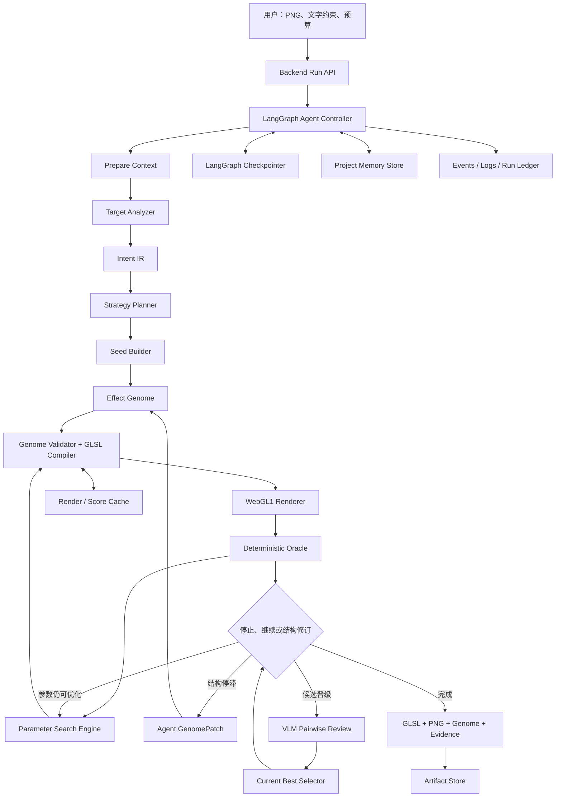
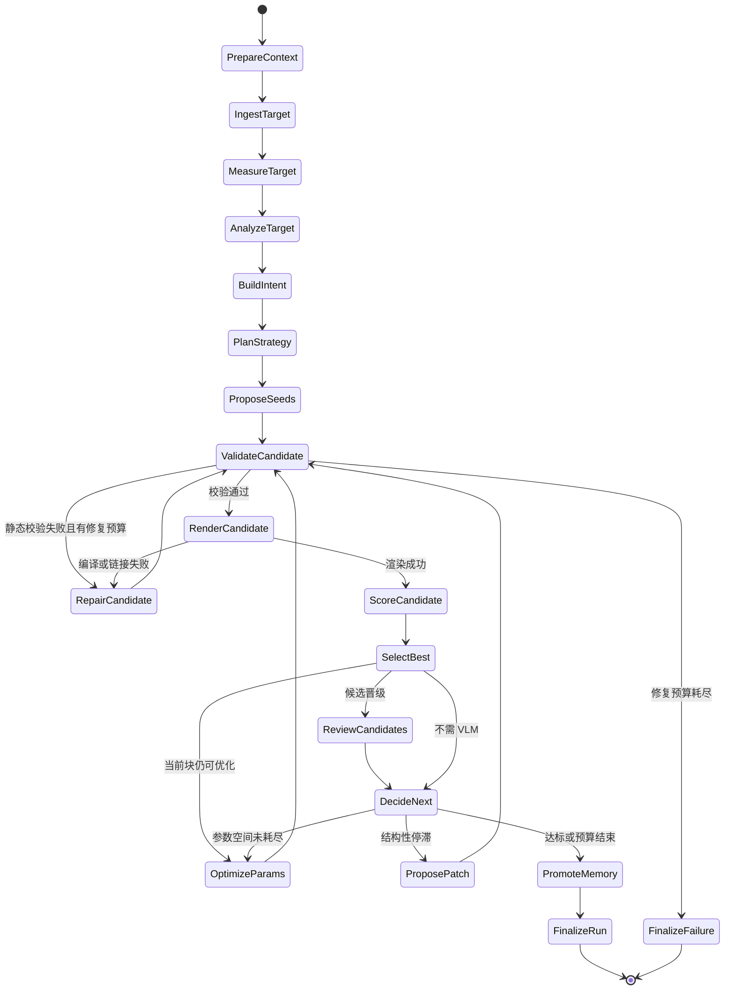

# PNG 转无贴图 Shader Agent 最终架构

> 归档状态：历史目标参考，“最终架构”只是当时方案名称。
>
> 文档性质：目标架构与实施基线  
> 适用项目：ShaderGen / ShaderForge  
> 核心任务：输入一张 PNG，在不采样输入贴图的前提下，自动生成可在 WebGL1 中运行、可量化评估、可继续优化的 GLSL Fragment Shader。  
> 关联文档：`图片复刻无贴图Shader方法论与技术细节.md`、`shaderforge-final-technical-plan.md`

配套图示：`PNG转无贴图Shader-Agent架构图与运行时序图.md`

历史 V1 实现规格与 Prompt 文档已退役，不再作为仓库入口。

---

## 1. 最终结论

最终系统不是一个“看图后一次性吐 GLSL”的大模型调用，而是一个由 Agent 编排、由确定性工具执行、由真实 WebGL 验证的受控优化系统：

```text
PNG + 用户约束
  → 运行时契约锁定
  → 图像测量与视觉分层
  → Intent IR
  → Effect Genome 候选种子
  → GLSL 编译
  → 真实 WebGL1 渲染
  → 全局与局部 Oracle 评分
  → 固定拓扑参数搜索
  → Agent 阶段性结构修订
  → VLM / 人工最终评审
  → 输出最佳 GLSL、预览图、参数、评分和完整复现证据
```

最终采用以下职责分工：

- **Agent 负责语义和结构决策**：分析视觉层、选择 2D SDF 或伪 3D 模型、提出 Genome seed、解释停滞、在阶段边界提出结构变更。
- **ShaderForge 负责确定性执行**：图像测量、Genome 校验、GLSL 生成、WebGL 渲染、指标计算、参数搜索、缓存和产物存储。
- **Oracle 负责可比较的事实**：编译是否成功、轮廓是否匹配、关键区域颜色是否正确、边缘和高光是否接近、候选是否真正优于当前最佳。
- **VLM 负责难以公式化的视觉判断**：材质感、层次感、风格一致性、明显但难以局部化的视觉问题；它不进入每一次数值优化内循环。
- **人工负责最终偏好与例外处理**：选择视觉偏好、确认已经足够、修改硬约束或批准扩大预算。

系统必须始终保存 `current_best`。新候选只有在通过硬约束且评分改善后才能替换它，不能默认“最后一轮就是最好的一轮”。

---

## 2. 目标、边界与非目标

### 2.1 输入

- 必选：一张 PNG、JPEG 或 WebP 参考图。
- 可选：自然语言要求，如“不要动画”“背景透明”“高光更克制”。
- 可选：运行时目标，如 WebGL1、WebGL2、Shadertoy；首期只实现 WebGL1。
- 可选：输出尺寸、透明背景、最大迭代数、时间预算和质量档位。
- 可选：用户标注的主体区域、颜色、关键高光或禁止修改区域。

### 2.2 输出

一次成功运行至少输出：

- 最佳 Fragment Shader GLSL；
- 固定的 Vertex Shader 或宿主契约版本；
- 最佳预览 PNG；
- `IntentIR`；
- `EffectGenome`；
- 总分、局部评分和硬约束结果；
- 每轮候选谱系和参数变化；
- 编译日志、渲染器版本、指标版本、模型版本、随机种子；
- 可直接复现的 WebGL HTML 或等价运行包。

### 2.3 首期适用范围

- 单主体或少量主体；
- 2D 图形、徽标、胶状圆盘、软光斑、玻璃感、霓虹、渐变、简单云雾；
- 可由 SDF、解析颜色场、Gaussian、噪声和混合规则表达的静态效果；
- 目标图本身可以是 3D 观感，但输出允许使用 2D 直接拟合。

### 2.4 明确不做

- 不在生成后的 Shader 中使用 `texture2D(u_image, ...)` 或任何参考图采样；
- 不承诺首期复刻复杂真实场景、人物、文字排版或大量离散细节；
- 不把自由 GLSL 当作主要搜索空间；
- 不让 LLM 在每次参数评估中做判断；
- 不在 v1 做通用 GLSL 到 Genome 的逆向反解析；
- 不把完整图片、完整 GLSL 和长推理永久写入项目记忆。

---

## 3. 核心设计原则

### 3.1 先锁运行时，再谈视觉

同一个 Shader 在 Shadertoy、WebGL1、WebGL2 和不同宿主中的入口、坐标、精度、alpha、DPR 与 uniform 语义都可能不同。任何分析和生成开始前必须创建不可歧义的 `RenderContract`。

### 3.2 先分析“视觉层”，不先识别“物体名称”

Agent 的首要问题是：

- 主体边界是什么；
- 颜色如何随位置变化；
- 高光、暗部、雾化、描边和投影分别在哪；
- 哪些层由位置控制，哪些层由方向或半径控制；
- 各层按什么顺序混合。

“这是粉色玻璃球”只是一种语义提示，不能直接替代可渲染结构。

### 3.3 直接拟合优先，物理正确按需升级

默认策略是 2D SDF 分层合成。只有在 2D 模型无法稳定解释参考图时，才升级到伪球面法线、Bezier 边界或其他模型。复杂度必须由误差证据触发，而不是由物体名称触发。

### 3.4 语义外循环，数值内循环

- Agent 外循环：低频、结构化、有预算；
- Search 内循环：高频、确定性、无 LLM；
- VLM 评审：只在初始分析、晋级和最终候选上调用。

### 3.5 单调接受与证据绑定

每个候选必须绑定其父候选、修改域、编译结果、渲染图和评分。候选若违反硬约束或没有达到最小改善，不得覆盖 `current_best`。

### 3.6 一个迭代只解决一个主问题域

问题域固定为：

- `runtime_compile`
- `geometry`
- `background_shadow`
- `base_color_field`
- `rim_edge`
- `highlight`
- `fine_detail`
- `global_balance`

这样可以定位改动收益，避免一轮同时修改十几个参数导致退化不可解释。

---

## 4. 总体系统架构



### 4.1 四层边界

| 层 | 职责 | 禁止事项 |
|---|---|---|
| Frontend | 上传、配置、进度、候选对比、人工选择、预览 | 不承担唯一的自动闭环，不决定评分真值 |
| Backend | HTTP、鉴权、任务生命周期、流式事件、产物下载 | 不直接 import Node、Prompt 或具体模型 |
| Agent | LangGraph 编排、语义分析、阶段决策、VLM/LLM 调用 | 不实现图像算法、渲染器或优化器 |
| ShaderForge | IR、Genome、编译、渲染、Oracle、搜索、缓存、存储 | 不依赖 Web API 或具体 LLM Provider |

依赖方向：

```text
frontend → backend → agent services
agent graphs → nodes → contracts ← llms
agent nodes/tools → shaderforge public APIs
shaderforge core 不反向依赖 agent/backend/frontend
```

---

## 5. 运行时契约 RenderContract

### 5.1 WebGL1 首期契约

```yaml
contract_id: webgl1_static_no_texture_v1
glsl_version: GLSL_ES_100
precision: mediump
vertex_input: a_position
fragment_varying: v_uv
uniforms:
  u_resolution: vec2
  u_time: float
optional_legacy_uniforms:
  u_image: sampler2D
texture_sampling_allowed: false
uv_origin: bottom_left
color_output: straight_alpha_srgb
animation: false
```

生成 Prompt、静态校验器、Renderer 和前端预览必须引用同一个契约定义，不能分别复制一份文字说明。

### 5.2 无贴图硬约束

静态校验直接拒绝：

- `texture2D`、`textureCube`、`texelFetch`；
- 任何采样宏或绕过式函数；
- 未声明扩展；
- 不符合目标 GLSL 版本的语法；
- 超出限制的循环、数组、动态索引或源码长度；
- 违反 uniform / varying 名称和类型的代码。

为兼容现有前端，可以暂时保留未使用的 `u_image` uniform 声明和绑定，但契约必须明确禁止采样。后续前端可按 `texture_sampling_allowed` 决定是否创建纹理。

### 5.3 数值与颜色规范

- 统一 UV 原点和 Y 轴方向；
- 几何归一化默认按短边缩放，避免画布宽高比拉伸；
- framebuffer 尺寸使用 CSS 尺寸乘 DPR；
- `u_resolution` 传入真实 framebuffer 尺寸；
- 明确 straight alpha / premultiplied alpha；
- 明确目标图与渲染图比较时的 sRGB / linear 转换；
- WebGL context 使用确定性参数并记录浏览器、GPU、驱动和 renderer version。

---

## 6. Target Analyzer：从 PNG 到 Intent IR

Target Analyzer 不是单一 VLM 节点，而是“确定性测量 + VLM 解释 + schema 校验”的组合。

### 6.1 确定性测量

优先计算：

- 图片宽高、alpha 分布、背景候选颜色；
- 主体 mask 候选与 bbox；
- 轮廓、中心、半径、长短轴、方向；
- 主色调色板与 Lab 颜色统计；
- 代表性像素；
- 梯度方向；
- 高亮、暗部、阴影和边缘候选区域；
- 对称性、径向性、边缘软硬和局部频率；
- 多尺度边缘图和显著区域。

任何自动 mask 都必须带置信度。阴影、光晕和主体容易粘连时，要保留多个 mask 假设，而不是把一个不可靠 bbox 当成事实。

### 6.2 VLM 视觉分层

VLM 输入参考图和测量摘要，输出：

- 可观察事实；
- 视觉层及其前后顺序；
- 每层可能的数学原语；
- 位置场、方向场、径向场的使用建议；
- 2D SDF、伪 3D 或复杂模型的策略候选；
- 不确定项及备选解释。

VLM 不直接输出最终 GLSL。

### 6.3 Intent IR

```python
class IntentIR:
    schema_version: str
    canvas: CanvasIntent
    objects: list[ObjectIntent]
    layers: list[VisualLayerIntent]
    relations: list[RelationIntent]
    regions: list[RegionOfInterest]
    representative_pixels: list[PixelProbe]
    hard_constraints: list[Constraint]
    soft_preferences: list[Preference]
    strategy_hypotheses: list[StrategyHypothesis]
    uncertainties: list[Uncertainty]
```

`VisualLayerIntent` 至少包含：

```python
class VisualLayerIntent:
    layer_id: str
    role: Literal[
        "background", "shadow", "base_fill", "color_lobe",
        "haze", "rim", "outline", "highlight", "detail"
    ]
    order: int
    target_region: str
    primitive_candidates: list[str]
    observed_color: LabRange
    opacity_range: tuple[float, float]
    confidence: float
    evidence_refs: list[str]
```

Intent 必须区分：

- `observed`：从像素可直接测量；
- `inferred`：VLM 或规则推断；
- `optimizable`：交给搜索器调节；
- `hard_constraint`：不得违反。

---

## 7. Strategy Planner：选择视觉模型

### 7.1 策略优先级

1. **2D SDF 分层直接拟合**：默认策略；
2. **解析伪表面**：适合球面、玻璃、光照明显受法线控制的目标；
3. **精确曲线 / 组合 SDF**：轮廓不是简单圆、椭圆、矩形时使用；
4. **程序噪声与域变换**：只有在目标确实包含随机纹理时启用；
5. **受限 Raymarch**：后续版本，仅在前述模型证据性失败时启用。

### 7.2 模型升级条件

只有满足以下任一条件才允许提高复杂度：

- 轮廓局部误差长期高于阈值且现有 SDF 无可调自由度；
- 高光位置随伪法线变化，2D 层无法同时匹配多个区域；
- 残差图存在稳定、结构化、跨多轮不下降的模式；
- Agent 提出的升级 Patch 通过复杂度预算和预期收益校验。

### 7.3 复杂度惩罚

总目标中加入复杂度项：

```text
objective = visual_loss
          + λ_nodes * node_count
          + λ_ops * estimated_shader_ops
          + λ_risk * numerical_risk
```

效果近似时优先选择节点更少、Shader 更短、数值更安全的候选。

---

## 8. Effect Genome：唯一可搜索中间表示

### 8.1 为什么不用自由 GLSL 做主搜索空间

自由 GLSL 很难：

- 判断某个常量影响哪一层；
- 安全地修改一个局部参数；
- 约束无贴图和 WebGL1 兼容性；
- 做连续参数搜索；
- 解释候选谱系；
- 复用历史策略。

因此主路径为 `Intent IR → Effect Genome → GLSL`。LLM 只输出类型化 Genome 或 `GenomePatch`。

### 8.2 Genome 结构

```python
class EffectGenome:
    schema_version: str
    genome_id: str
    contract_id: str
    strategy: str
    canvas: CanvasNode
    nodes: list[EffectNode]
    edges: list[EffectEdge]
    parameters: list[ParameterSpec]
    outputs: OutputSpec
    provenance: Provenance
```

首期节点：

- 几何：`CircleSDF`、`EllipseSDF`、`RectSDF`、`RoundedRectSDF`；
- 变换：`Translate`、`Scale`、`Rotate`；
- 场：`LinearField`、`RadialField`、`AngularField`、`GaussianField`；
- 颜色：`SolidColor`、`LinearGradient`、`RadialGradient`、`ColorLobe`；
- 边缘：`FillMask`、`RimBand`、`OutlineBand`、`InnerSheen`；
- 光效：`Glow`、`Haze`、`ArcHighlight`、`Shadow`；
- 细节：`ValueNoise`、`FBM`，默认禁用；
- 组合：`Mask`、`Mix`、`Add`、`Multiply`、`ScreenLike`、`Over`；
- 输出：`ColorOutput`。

### 8.3 参数规范

每个参数声明：

```python
class ParameterSpec:
    path: str
    dtype: str
    value: float | tuple | str
    min_value: float | None
    max_value: float | None
    optimizable: bool
    block: str
    affected_regions: list[str]
    semantic_role: str
```

`path` 必须稳定，才能构建参数 manifest、缓存键和谱系 diff。

### 8.4 可复用数学积木

Genome 编译器应内置经过验证的安全实现：

- 短边归一化坐标；
- circle / ellipse / rounded rect SDF；
- `smoothstep` 抗锯齿 mask；
- 数值安全 Gaussian；
- 径向环带；
- 旋转坐标；
- `radial band × angular window` 弧形高光；
- 局部颜色团；
- rim、outline、inner sheen；
- 背景投影和雾化；
- 显式 alpha 合成。

重要语义约束：广域颜色渐变使用连续位置坐标，不能误用单位方向 `normalize(p)`；方向坐标只用于角向效应，否则圆心可能产生接缝。

---

## 9. Compiler 与 Renderer

### 9.1 编译链

```text
EffectGenome
  → schema validation
  → graph validation
  → parameter range validation
  → contract validation
  → GLSL AST / structured emitter
  → static safety validation
  → WebGL compile + link
  → render
```

不要使用字符串替换对 GLSL 做核心修改。Genome 编译器应由结构化 emitter 生成稳定代码，并在源码中保留 node id 注释，便于把编译或视觉问题追溯到节点。

### 9.2 真实 WebGL Renderer 是最终真值

最终验收必须在真实浏览器 WebGL1 环境完成，包括：

- 创建 context；
- 编译 vertex / fragment shader；
- 链接 program；
- 设置 framebuffer、viewport、uniform；
- 绘制全屏三角形；
- 等待 GPU 完成；
- 读取像素或截图；
- 收集 console、compile、link、context loss 信息。

页面能打开不等于 Shader 成功，canvas 非空也不等于视觉正确。

### 9.3 Cheap Renderer

Cheap Renderer 用于高频搜索，但不是 v1 首日必需条件。只有当真实 WebGL 成为性能瓶颈并完成 parity 测试后，才能进入搜索主链路。

若启用，两条路径必须统一：

- 坐标；
- alpha；
- 混合顺序；
- 抗锯齿；
- 颜色空间；
- 噪声实现；
- 浮点精度近似。

推荐门槛：`RGB MAE ≤ 3/255`、`alpha MAE ≤ 3/255`、主要 mask `IoU ≥ 0.98`。

### 9.4 mediump 数值安全

编译器和 validator 检查：

- 大像素坐标先平方导致溢出；
- 极小差值先平方导致下溢；
- 除零和接近零的分母；
- `normalize(vec2(0.0))`；
- 过大的指数输入；
- 非法 `smoothstep(edge0, edge1, x)` 顺序；
- 依赖高精度但声明 `mediump` 的表达式。

数值风险既是硬校验，也是复杂度评分的一部分。

---

## 10. Deterministic Oracle：全局与局部评价

### 10.1 评分结构

```python
class ScoreBreakdown:
    metric_version: str
    total_loss: float
    hard_constraints_passed: bool
    global_metrics: GlobalMetrics
    geometry: GeometryMetrics
    color: ColorMetrics
    edge: EdgeMetrics
    regions: dict[str, RegionMetrics]
    probes: list[PixelProbeResult]
    complexity: ComplexityMetrics
    diagnostics: list[Diagnostic]
```

### 10.2 指标组成

推荐总损失：

```text
L = w_global  * L_global
  + w_shape   * L_shape
  + w_color   * L_color
  + w_edge    * L_edge
  + w_region  * Σ L_roi
  + w_probe   * L_probe
  + w_cover   * L_coverage
  + w_complex * L_complexity
```

具体指标：

- 全局：RMSE / MAE、SSIM、多尺度差异；
- 颜色：Lab ΔE、主色分布、区域均值与方差；
- 形状：bbox、中心、面积、IoU、轮廓 Chamfer 或距离变换损失；
- 边缘：边缘位置、强度、宽度和方向；
- 区域：背景、主体、左上高光、右下高光、阴影、rim 分开评分；
- 探针：代表像素的 RGB/Lab 差值；
- coverage：防止候选通过少画主体来降低局部误差；
- 复杂度：节点数、估算操作数和数值风险。

### 10.3 Mask 原则

- 颜色损失不能只在候选自身 mask 内计算；
- 默认使用目标 mask 与候选 mask 的并集；
- 小对象和高光必须单独评分，避免被大面积背景淹没；
- 背景、阴影、光晕与主体 mask 分开；
- mask 不确定时保留多个解释并降低权重。

### 10.4 指标不是审美真值

RMSE 适合发现总体偏差，但可能奖励模糊；SSIM 关注结构，但不保证颜色；bbox 对位置和尺寸有效，但可能把阴影误算成主体。因此最终决策使用评分向量、残差图、VLM pairwise 和必要的人工确认，而不是只看一个总分。

---

## 11. Search Engine：固定拓扑参数优化

### 11.1 参数优化流程

```text
Genome seed
  → build manifest
  → flatten optimizable parameters
  → normalize to [0, 1]
  → select one parameter block
  → generate candidates
  → compile / render / score
  → update archive and current_best
  → stagnation check
  → next block or return control to Agent
```

### 11.2 分块顺序

默认依赖顺序：

1. geometry；
2. background_shadow；
3. base_color_field；
4. rim_edge；
5. highlight；
6. fine_detail；
7. global_balance。

每个块只开放与其 `affected_regions` 对应的参数，冻结其他参数。若局部优化使无关区域退化超过阈值，拒绝该候选。

### 11.3 优化算法

分阶段采用：

- v1：网格 / 随机扰动 + coordinate descent；
- v1.1：CMA-ES 或类似无梯度优化；
- v1.5：top-k + 多样性 archive，必要时 MAP-Elites。

算法可替换，但统一依赖 `ParameterManifest`、`Renderer`、`Oracle` 和 `CandidateArchive`。

### 11.4 缓存

缓存键至少包含：

```text
normalized_genome_hash
contract_id
renderer_version
metric_version
target_image_hash
render_size
```

源码格式、字段顺序和浮点序列化必须规范化，否则同一 Genome 会产生无效重复计算。

---

## 12. Agent Controller：LangGraph 状态机

### 12.1 Agent 节点

| 节点 | 类型 | 单一职责 |
|---|---|---|
| `prepare_context` | 确定性 | 按 project_id 组装约束、策略与历史经验 |
| `ingest_target` | 确定性 | 校验图片、计算 hash、创建 RenderContract |
| `measure_target` | 确定性 | 生成 mask、bbox、颜色、边缘、ROI、像素探针 |
| `analyze_target` | VLM | 输出视觉分层、假设和不确定项 |
| `build_intent` | 混合 | 合并测量与 VLM，生成并校验 Intent IR |
| `plan_strategy` | LLM/规则 | 选择模型和复杂度预算 |
| `propose_seeds` | LLM/模板 | 生成 3–5 个合法 Genome seed |
| `validate_candidate` | 确定性 | schema、契约、数值和复杂度检查 |
| `render_candidate` | 工具 | 编译并在真实 WebGL 中渲染 |
| `score_candidate` | 确定性 | 计算 ScoreBreakdown 和残差证据 |
| `optimize_params` | 工具 | 执行一个有边界的参数搜索阶段 |
| `summarize_archive` | 确定性 | 提炼 top-k、停滞域和退化原因 |
| `review_candidates` | VLM | 对晋级候选做 pairwise 视觉评审 |
| `propose_patch` | LLM | 输出类型化 GenomePatch |
| `select_best` | 确定性 | 以硬约束和接受规则更新 current_best |
| `decide_next` | 确定性优先 | 停止、继续参数搜索或请求结构修订 |
| `promote_memory` | 确定性 | 只晋升精炼后的经验、约束、评审和策略 |
| `finalize_run` | 确定性 | 固化产物、摘要和停止原因 |

Node 只做一件事。Renderer、Oracle、Search 算法不得塞进 Agent Node；Node 只能调用 ShaderForge 的类型化接口。

### 12.2 完整图



### 12.3 路由必须尽量确定性

以下判断不交给 LLM：

- 编译是否失败；
- 硬约束是否通过；
- 分数是否改善；
- 预算是否耗尽；
- 连续几轮无改善；
- 候选能否替换 current_best；
- 是否触发人工中断。

LLM 只在“错误如何修”“需要什么结构层”“残差可能说明什么”这类语义问题上提供建议。

### 12.4 主 Agent 与子 Agent 划分

最终架构包含 **1 个主控 Agent + 4 个专业子 Agent**。这里的 Agent 指需要 LLM / VLM 进行语义判断、具有独立输入输出契约的角色；Renderer、Oracle、Search Engine、Selector、Store 和 Cache 都是确定性工具或服务，不算子 Agent。

| 角色 | 类型 | 核心职责 | 主要输出 | 版本 |
|---|---|---|---|---|
| `PngToShaderOrchestrator` | 主控 Agent | 管理阶段、预算、路由、重试、停止和产物汇总 | 状态迁移、停止原因 | V1 |
| `VisualAnalysisAgent` | 子 Agent 1 | 根据参考图和确定性测量结果进行视觉分层 | `VisualAnalysis` / `IntentIR` 草案 | V1 |
| `ShaderAuthorAgent` | 子 Agent 2 | 选择直接拟合策略、生成初稿，并根据结构化错误和评分做有限修订 | V1 为受限 GLSL；V2 为 Genome seed / Patch | V1 |
| `VisualCriticAgent` | 子 Agent 3 | 对参考图和渲染图做区域化视觉诊断，补充指标难以描述的问题 | `VisualReview`、问题域、修订建议 | V1 |
| `StructureEvolutionAgent` | 子 Agent 4 | 在参数搜索停滞后提出节点增删、连接变化和模型升级 | `GenomePatch` | V2 |

V1 实际运行结构为：

```text
PngToShaderOrchestrator
├── VisualAnalysisAgent
├── ShaderAuthorAgent
└── VisualCriticAgent

确定性能力
├── Image Measurement
├── GLSL Contract / Safety Validator
├── WebGL1 Renderer
├── Basic Oracle
├── Current Best Selector
├── Artifact Store
└── Budget / Stop Controller
```

V1 不单独实现 `StructureEvolutionAgent`。初稿生成、编译修复和最多 3–5 轮的视觉修订由同一个 `ShaderAuthorAgent` 完成，但使用不同 Prompt 和类型化输入输出。这样可以减少角色切换与上下文复制，同时保持节点职责分离。

V2 引入 Effect Genome 和确定性参数搜索后，再把结构级变异从 `ShaderAuthorAgent` 中拆出为独立的 `StructureEvolutionAgent`。它只在 Search Engine 判定结构性停滞时调用，不参与正常参数内循环。

子 Agent 在实现上不要求是独立进程，也不要求拥有彼此隔离的长期会话。V1 推荐将它们实现为 LangGraph 中依赖同一 `LLMGateway` 的类型化节点或子图；主控图持有运行状态，子 Agent 只接收完成当前任务所需的最小上下文并返回结构化结果。

---

## 13. Graph State、Runtime Context 与持久化

### 13.1 三类数据

**Checkpoint 状态**：可恢复、体积小、描述任务进度。

```python
class PngToShaderState:
    project_id: str
    run_id: str
    phase: str
    iteration: int
    problem_domain: str
    intent_ref: str
    strategy_ref: str
    current_candidate_id: str
    current_best_id: str
    archive_summary: dict
    budget: BudgetState
    stop_reason: str | None
```

**Untracked / 临时数据**：只在当前调用中使用，不进入 checkpoint。

- 原始图片 bytes；
- 渲染图片 bytes；
- 完整 GLSL；
- 完整残差图；
- 当前模型调用原始响应；
- 临时 context pack。

**Artifact 引用**：大对象进入 Artifact Store，state 只保存 URI、hash 和 metadata。

### 13.2 Runtime Context

每次运行但不应进入图状态的配置放入 `Runtime[Context]`：

```python
class PngToShaderRuntimeContext:
    model_policy: ModelPolicy
    render_backend: str
    artifact_store: ArtifactStore
    max_wall_time_s: int
    cancellation_token: CancellationToken
    tenant_id: str | None
```

### 13.3 项目记忆

沿用 `project_id` 作为长期连续性边界：

- 可写入：稳定约束、成功策略、失败模式、用户偏好、评审结论；
- 不写入：原始图片、完整 GLSL、完整模型推理、逐轮像素数据；
- Review 记忆必须绑定当前 Shader hash / iteration，避免旧建议污染新候选；
- 不同 project_id 绝不共享私有记忆；
- 跨项目复用只通过显式、去标识化的公共经验库完成。

---

## 14. Candidate、Patch 与接受规则

### 14.1 CandidateRecord

```python
class CandidateRecord:
    candidate_id: str
    parent_id: str | None
    genome_ref: str
    glsl_ref: str
    render_ref: str
    residual_ref: str | None
    compile_result: CompileResult
    score: ScoreBreakdown | None
    changed_domain: str
    changed_parameters: list[str]
    lineage_depth: int
    created_by: str
    model_ref: str | None
    seed: int
```

### 14.2 GenomePatch

```python
class GenomePatch:
    patch_id: str
    base_genome_id: str
    intent: str
    problem_domain: str
    operations: list[PatchOperation]
    expected_regions: list[str]
    expected_metric_changes: dict[str, str]
    complexity_delta_limit: int
```

允许的 Patch 操作：添加节点、删除节点、替换节点类型、改连接、修改参数范围。Patch 应先通过 schema、引用完整性、循环依赖、复杂度和契约校验，再成为候选。

### 14.3 current_best 接受规则

候选必须同时满足：

1. 静态检查通过；
2. WebGL compile / link / draw 通过；
3. 无贴图等硬约束通过；
4. 目标问题域达到最小改善；
5. 无关保护区域退化不超过阈值；
6. 总目标改善，或由 Pareto / VLM / 人工明确批准的等价交换；
7. 复杂度没有无理由增长。

默认接受判定：

```text
accept = hard_constraints_passed
     and target_domain_gain >= min_domain_gain
     and protected_region_regression <= max_regression
     and total_loss_gain >= min_total_gain
```

---

## 15. 停止、预算与失败恢复

### 15.1 默认预算

建议初始默认值，可通过配置调整：

- Genome seeds：3；
- 静态 / 编译修复：每个结构最多 2 次；
- 参数块：每块最多 20–50 次评估；
- 结构 Patch：最多 3 轮；
- VLM 晋级评审：最多 2 轮；
- 连续 2 个阶段无有效改善则判定停滞；
- 全局 wall time 与模型 token 预算必须是硬上限。

### 15.2 停止条件

- 达到质量阈值；
- 所有关键局部指标达到阈值；
- 连续阶段无有效改善；
- 搜索、时间、token 或渲染次数耗尽；
- 复杂度升级仍不能解释残差；
- 用户手动接受或取消；
- 系统性运行时错误无法恢复。

预算结束时仍输出历史 `current_best`，并明确 `stop_reason`，不能把最后失败候选作为结果。

### 15.3 错误分类

| 类型 | 自动处理 |
|---|---|
| Schema / Contract 错误 | 结构化校验信息返回 Patch 生成器 |
| GLSL compile / link 错误 | 最多两次受限修复，保留完整日志 |
| WebGL context loss / 浏览器崩溃 | 重建 worker，重放同一候选一次 |
| 数值异常 / 全黑 / NaN | 拒绝候选并标记风险节点 |
| 指标异常 | 终止自动接受，保留图像供诊断 |
| LLM / VLM 超时 | 退化到模板 seed 或 AI-off 搜索 |
| Artifact Store 失败 | 不晋升状态；幂等重试 |
| 用户取消 | 安全停止，保存 current_best 与已完成证据 |

---

## 16. VLM 与 HITL

### 16.1 VLM 角色

VLM 只处理：

- 初始视觉分层；
- top-k 候选 pairwise 比较；
- 指标与人感知明显冲突时的解释；
- 参数搜索停滞后的结构假设；
- 最终材质感和风格一致性评审。

### 16.2 Pairwise 协议

- 同时展示参考图、候选 A、候选 B；
- 随机左右顺序；
- 使用固定 rubric：轮廓、颜色、光照、高光、边缘、材质、背景；
- 输出选择、置信度、主要理由和需要修复的区域；
- 不允许只输出模糊的“更像”。

### 16.3 人工介入点

前端应允许用户：

- 确认或修正主体 mask；
- 锁定某一颜色或区域；
- 在 top-k 中选择偏好；
- 标注“高光太长”“边缘太硬”等问题域；
- 接受当前结果；
- 批准增加预算或提高模型复杂度。

人工反馈要转成结构化 Constraint / Preference，而不是只留在聊天文本中。

---

## 17. Store、可复现性与可观测性

### 17.1 存储分层

| 存储 | 内容 |
|---|---|
| PostgreSQL / Run Ledger | run、阶段、状态、分数摘要、模型调用、错误、版本 |
| LangGraph Checkpointer | 可恢复的小型图状态 |
| Project Memory Store | 筛选后的长期约束、策略、评审和失败经验 |
| Artifact Store | 输入图、渲染图、残差图、GLSL、Genome、HTML、日志 |
| Content Cache | render、score、VLM judgment 的内容哈希缓存 |

### 17.2 Artifact 目录

```text
runs/{project_id}/{run_id}/
├── input/
│   ├── reference.png
│   └── request.json
├── analysis/
│   ├── measurements.json
│   ├── masks/
│   └── intent_ir.json
├── candidates/{candidate_id}/
│   ├── genome.json
│   ├── shader.frag
│   ├── render.png
│   ├── residual.png
│   ├── compile.json
│   └── score.json
├── final/
│   ├── shader.frag
│   ├── render.png
│   ├── genome.json
│   ├── preview.html
│   └── manifest.json
└── run-summary.json
```

### 17.3 复现 Manifest

最终 manifest 必须记录：

- input hash；
- contract id；
- Genome schema version；
- renderer / metric / compiler version；
- model provider、model ref、prompt version；
- seed、预算、停止原因；
- 浏览器、WebGL vendor / renderer；
- 候选 parent lineage；
- code version 或构建版本；
- 所有产物的 hash。

### 17.4 事件模型

前端消费结构化事件：

```text
run.started
analysis.completed
seed.created
candidate.validation_failed
candidate.rendered
candidate.scored
current_best.updated
search.stage_completed
agent.patch_proposed
review.completed
run.completed
run.failed
```

事件只带摘要和 artifact ref，不携带大图片 bytes。

---

## 18. Backend API 与前端交互

### 18.1 异步 Run API

```text
POST   /api/shader/runs
GET    /api/shader/runs/{run_id}
GET    /api/shader/runs/{run_id}/events
POST   /api/shader/runs/{run_id}/feedback
POST   /api/shader/runs/{run_id}/cancel
GET    /api/shader/runs/{run_id}/candidates
GET    /api/shader/runs/{run_id}/artifacts/{artifact_id}
DELETE /api/shader/projects/{project_id}/memory
```

创建 Run 的请求：

```json
{
  "project_id": "project-123",
  "target": "multipart image",
  "contract_id": "webgl1_static_no_texture_v1",
  "instruction": "保持白色背景，静态，无贴图",
  "quality_preset": "balanced",
  "budget": {
    "max_wall_time_s": 600,
    "max_render_evaluations": 300,
    "max_model_calls": 12
  }
}
```

### 18.2 前端页面

最小产品界面包含：

- 输入区：上传、约束、质量和预算；
- 参考分析区：主体 mask、bbox、视觉层、策略；
- 实时进度区：阶段、迭代、预算、事件；
- 对比区：参考图、current_best、残差热图、候选 A/B；
- 指标区：全局和关键 ROI；
- Shader 区：GLSL、编译日志、真实 WebGL 预览；
- 人工反馈区：锁定区域、选择候选、继续或接受；
- 产物下载区：GLSL、PNG、HTML、Genome、manifest。

前端的 WebGLPreview 继续作为用户侧兼容性验证，但服务端或独立 renderer worker 必须能完成自动闭环，不能要求浏览器 UI 一直打开。

---

## 19. 推荐代码目录

```text
src/
├── agent/app/
│   ├── contracts/
│   │   ├── llm.py
│   │   └── shaderforge.py
│   ├── graphs/
│   │   └── png_to_shader_graph.py
│   ├── nodes/
│   │   ├── ingest_target_node.py
│   │   ├── analyze_target_node.py
│   │   ├── build_intent_node.py
│   │   ├── plan_strategy_node.py
│   │   ├── propose_seeds_node.py
│   │   ├── render_candidate_node.py
│   │   ├── score_candidate_node.py
│   │   ├── optimize_params_node.py
│   │   ├── review_candidates_node.py
│   │   ├── propose_patch_node.py
│   │   ├── select_best_node.py
│   │   ├── decide_next_node.py
│   │   └── finalize_run_node.py
│   ├── states/
│   │   └── png_to_shader_state.py
│   ├── tools/
│   │   └── shaderforge_tools.py
│   └── services/
│       └── png_to_shader.py
└── shaderforge/
    ├── contracts/
    │   ├── render_contract.py
    │   └── versions.py
    ├── analysis/
    │   ├── measurements.py
    │   ├── segmentation.py
    │   ├── palette.py
    │   └── regions.py
    ├── intent/
    │   ├── models.py
    │   └── validation.py
    ├── genome/
    │   ├── models.py
    │   ├── nodes.py
    │   ├── patches.py
    │   ├── manifest.py
    │   └── validation.py
    ├── compiler/
    │   ├── emitter.py
    │   ├── stdlib.py
    │   └── safety.py
    ├── rendering/
    │   ├── contracts.py
    │   ├── webgl_worker.py
    │   └── cheap_renderer.py
    ├── evaluation/
    │   ├── oracle.py
    │   ├── geometry.py
    │   ├── color.py
    │   ├── edge.py
    │   ├── regions.py
    │   └── residuals.py
    ├── search/
    │   ├── engine.py
    │   ├── optimizers.py
    │   ├── archive.py
    │   └── stopping.py
    ├── store/
    │   ├── artifacts.py
    │   ├── cache.py
    │   └── provenance.py
    └── public.py
```

每个一级包建立 `ARCHITECTURE.md`，说明职责、公共 API、允许依赖和禁止依赖。Agent 应只依赖 `shaderforge.public` 或明确定义的 contracts，不散落 import 内部实现。

---

## 20. Prompt 体系

Prompt 必须拆分，不能继续用一个互相矛盾的 `image_to_glsl` Prompt 同时表达“无贴图”和“必须 texture2D”。

推荐 Prompt：

```text
analyze_visual_layers.yaml
plan_shader_strategy.yaml
propose_genome_seeds.yaml
repair_genome.yaml
propose_genome_patch.yaml
review_candidate_pair.yaml
summarize_final_result.yaml
```

每个 Prompt：

- 输入和输出都有 schema；
- 明确 RenderContract；
- 明确哪些是事实、推断和不确定项；
- 只允许一个职责；
- 使用版本号；
- 解析失败可重试一次，之后回退到模板或确定性路径。

原 `image_to_glsl.yaml` 应拆成：

- `image_to_texture_shader`：允许采样的另一产品模式；
- `png_to_procedural_shader`：明确禁止采样；

两种模式不能共享互相冲突的约束文本。

---

## 21. 测试与质量门槛

### 21.1 单元测试

- Intent / Genome / Patch schema；
- 每个节点的参数范围和 GLSL emitter；
- `flatten → unflatten` 保真；
- 坐标、SDF、Gaussian、rim 和高光数学函数；
- mask、Lab ΔE、edge、coverage 和局部 loss；
- current_best 接受规则；
- budget、stagnation 和停止逻辑；
- cache key 规范化；
- 禁止纹理采样和数值风险扫描。

### 21.2 Agent 图测试

使用 Fake Gateway 和 Fake ShaderForge：

- 正常完成路径；
- seed 校验失败后修复；
- compile 失败后有界重试；
- 新候选退化时保持 current_best；
- 参数停滞后触发结构 Patch；
- 预算耗尽后仍输出最佳候选；
- 用户取消；
- VLM 不可用时走 AI-off 降级；
- 图不会出现无限循环。

### 21.3 Renderer 集成测试

- 在真实 Chromium / WebGL1 中 compile、link、draw、capture；
- 验证 DPR、viewport、Y 翻转、alpha 和颜色空间；
- console 和 shader log 必须为空或符合预期；
- 同一候选重复渲染结果在容差内稳定；
- 浏览器 worker 崩溃后可重建并重放。

### 21.4 Oracle 性质测试

对合成图做单变量扰动：

- 颜色偏离时颜色损失近似单调增加；
- 位置偏离时 shape / pose 损失增加；
- 边缘变硬时 edge loss 增加；
- 删除小高光时对应 ROI loss 明显增加；
- 删除主体时 coverage penalty 增加；
- 只改背景时前景损失基本不变。

### 21.5 端到端基准

建立分层 benchmark：

- L0：纯色圆、矩形、渐变；
- L1：软阴影、rim、单高光；
- L2：多色团、双高光、玻璃或胶状效果；
- L3：不规则组合 SDF、程序噪声；
- OOD：明确超出范围的复杂照片。

每个样本固定：目标图、硬约束、期望结构、关键 ROI、阈值和最大预算。

### 21.6 首期成功标准

- 100% 输出通过 WebGL1 compile / link；
- 100% 通过无贴图静态检查；
- 固定 seed、版本和预算时可复现；
- L0/L1 大多数样本相对初始 seed 有确定性指标提升；
- current_best 不发生单调退化；
- 所有 run 可回放到候选、分数、模型和产物；
- AI-off 路径可以运行，Agent 不可用时系统仍能交付模板 + 参数优化结果。

---

## 22. 分阶段迁移计划

当前 ShaderGen 已有 Generate、浏览器 Render、Review、Context/Memory 基础，但仍不是自动优化闭环。目标架构按以下阶段迁移。

### Phase 0：完成当前 active 功能

- 先完成并验收当前 F08 Memory / Context；
- 不在同一时间把 PNG→Shader 设为第二个 active 功能；
- 保留 `project_id`、`prepare_context`、`promote_memory` 和 Gateway 边界。

### Phase 1：可信最小闭环

交付：

- `RenderContract`；
- 无贴图 Prompt 修复；
- 服务端真实 WebGL renderer；
- compile / render artifact；
- 基础 Oracle：RMSE、bbox、关键像素、局部 ROI；
- bounded `generate → render → score → refine` 图；
- current_best 和最大 3–5 轮迭代。

这一阶段可暂时让 LLM 生成受限 GLSL，但必须保存参数化常量和证据。它是迁移桥，不是最终主架构。

### Phase 2：Intent IR + Effect Genome

交付：

- Target Analyzer；
- Intent schema；
- 8–15 类 Genome 节点；
- Genome → GLSL compiler；
- 3 个 seed；
- manifest 和可解释 Patch。

完成后，自由 GLSL 生成退为兼容 / 实验路径。

### Phase 3：确定性搜索与局部 Oracle

交付：

- 完整局部评分；
- 参数分块；
- coordinate descent / CMA-ES；
- 缓存；
- 停滞检测；
- current_best 单调接受；
- AI-on / AI-off 对照。

### Phase 4：结构修订、VLM 与 HITL

交付：

- GenomePatch；
- 残差驱动的结构升级；
- top-k 晋级；
- VLM pairwise；
- 人工区域约束和候选偏好。

### Phase 5：产品化

交付：

- 异步 Run API；
- SSE / WebSocket 进度；
- 运行回放和候选谱系；
- Artifact Store；
- nightly benchmark；
- 性能、成本和质量仪表盘。

---

## 23. 最小可用版本与最终版本的关系

### 23.1 最小可用版本

```text
PNG
  → 测量 + VLM 视觉分层
  → 受限 GLSL 初稿
  → 服务端 WebGL1 渲染
  → 基础局部评分
  → 最多 5 轮单问题域修订
  → 保存并输出 current_best
```

它可以快速验证“自动闭环是否真正提升效果”。

### 23.2 最终版本

```text
PNG
  → Intent IR
  → Effect Genome seeds
  → 确定性 compiler / renderer / oracle / search
  → Agent GenomePatch
  → VLM / HITL 晋级
  → 可复现的最佳 GLSL 与全套证据
```

两者不是两套系统。最小版本复用同一个 RenderContract、Renderer、Oracle、CandidateRecord、Artifact Store、current_best 和停止规则；之后只把“自由 GLSL 草稿”逐步替换为 Genome 编译路径。

---

## 24. 最终验收清单

### 契约

- [ ] WebGL1 contract 是单一事实源；
- [ ] Prompt、前端、renderer、validator 使用同一 contract；
- [ ] 无 `texture2D` 等采样；
- [ ] 坐标、DPR、alpha、颜色空间一致。

### 分析与表示

- [ ] 图像测量与 VLM 推断分离；
- [ ] Intent 区分事实、推断、不确定和约束；
- [ ] Genome schema 可校验、可编译、可搜索；
- [ ] 每个参数有稳定 path、范围和 affected regions。

### 渲染与评分

- [ ] 真实浏览器 compile、link、draw、capture；
- [ ] 保存 compile / console / context 日志；
- [ ] 全局、局部、轮廓、颜色、边缘、coverage 分开；
- [ ] 残差图和关键 ROI 可查看；
- [ ] 指标版本可追溯。

### Agent 闭环

- [ ] Node 单一职责；
- [ ] 确定性路由不交给 LLM；
- [ ] Agent 只在阶段边界改变结构；
- [ ] 每轮只处理一个主问题域；
- [ ] current_best 单调保护；
- [ ] 编译、迭代、时间和模型调用都有硬预算；
- [ ] AI-off 路径可用。

### 工程

- [ ] 大产物不进入 checkpoint 和长期 memory；
- [ ] 每个候选绑定 hash、父节点、版本和评分；
- [ ] Run 可取消、可恢复、可回放；
- [ ] 单元、集成、浏览器、端到端和 benchmark 均覆盖；
- [ ] 文档、代码与功能状态同步。

---

## 25. 一句话架构定义

**PNG 转无贴图 Shader Agent 是一个以 Intent IR 和 Effect Genome 为可解释中间表示、以真实 WebGL 渲染和局部 Oracle 为事实反馈、以确定性参数搜索为内循环、以 Agent 结构修订和 VLM/HITL 为外循环，并通过 current_best、硬预算和完整证据链保证质量不退化与结果可复现的程序化视觉拟合系统。**
