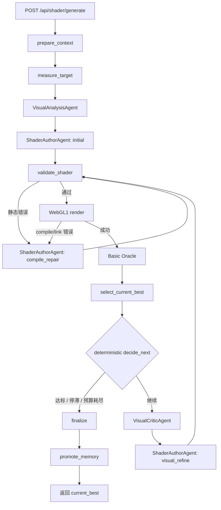

# PNG 转无贴图 Shader Agent：V1 实现计划与 Prompt

> 状态：实现前规格  
> 前置条件：F08 已通过；若用户确认开始实现，应将本功能登记为下一个唯一 `active` 功能。  
> 目标：在现有 ShaderGen 上实现服务端可运行的三子 Agent、有界、可验证、不会覆盖最佳结果的 PNG → 无贴图 WebGL1 GLSL 闭环。

配套 Prompt 草案位于：`human_doc/png-to-shader-v1-prompts/`。

---

## 1. V1 最终范围

### 1.1 V1 要解决的问题

当前链路是：

```text
PNG → 一次模型生成 GLSL → 前端渲染 → 一次 Review → 展示建议 → 结束
```

它存在四个核心缺口：

1. `image_to_glsl.yaml` 同时写了“禁止贴图”和“必须 texture2D”，契约冲突；
2. 生成后没有服务端真实 WebGL 编译和渲染门禁；
3. Review 只输出建议，不把建议应用到 GLSL；
4. 没有量化评分、`current_best`、预算和停止条件。

V1 将链路升级为：

```text
PNG
  → 确定性图像测量
  → VisualAnalysisAgent
  → ShaderAuthorAgent 生成初稿
  → 静态校验
  → 真实 WebGL1 编译与渲染
  → Basic Oracle 评分
  → 更新 current_best
  → VisualCriticAgent 选择一个主问题域
  → ShaderAuthorAgent 有限修订
  → 最多 2 个默认视觉迭代
  → 输出历史最佳 GLSL、预览图、评分与停止原因
```

### 1.2 V1 Agent 数量

V1 使用 **1 个确定性主控 + 3 个专业子 Agent**：

| 角色 | 是否调用模型 | 职责 |
|---|---:|---|
| `PngToShaderOrchestrator` | 否 | LangGraph 路由、预算、重试、接受和停止 |
| `VisualAnalysisAgent` | 是 | 把参考图解释成可实现的视觉层和坐标策略 |
| `ShaderAuthorAgent` | 是 | 生成初稿、修复编译错误、按一个问题域修订 Shader |
| `VisualCriticAgent` | 是 | 比较参考图与渲染结果，输出区域化诊断 |

Renderer、Oracle、Validator、Selector、Artifact Store 和 Memory 都不是 Agent。

### 1.3 V1 明确不做

- 不实现 Effect Genome；
- 不实现 CMA-ES、MAP-Elites 或确定性参数搜索；
- 不实现独立 `StructureEvolutionAgent`；
- 不做复杂 3D、Raymarch 和动画生成；
- 不做分布式任务队列；
- 不做完整 S3 Artifact 平台；
- 不做通用前景分割模型；
- 不允许生成结果采样参考图片；
- 不让 LLM 决定预算、是否编译成功或是否替换最佳候选。

这些能力属于 V2 或后续工程化阶段。

---

## 2. 从粉色凝胶 Shader 复刻中提炼的 V1 规则

以下经验必须变成代码、Prompt 和测试约束，而不是只留在说明文档中。

### 2.1 先固定运行时契约

统一使用 `webgl1_static_no_texture_v1`：

```text
precision mediump float;
varying vec2 v_uv;
uniform sampler2D u_image;   // 可以声明但不能采样
uniform vec2 u_resolution;
uniform float u_time;
gl_FragColor = ...;
```

禁止：

- `texture2D`、`textureCube`、`texture()`；
- `#version`；
- WebGL2 的 `in`、`out`、自定义 fragment output；
- 未声明扩展；
- 依赖参考图纹理的任何间接函数。

### 2.2 优先直接拟合，而不是追求物理正确

对于圆盘、凝胶、玻璃、光斑和徽标，默认使用：

```text
背景
→ 投影 / 光晕
→ 主体 SDF mask
→ 主颜色场
→ 局部色团 / 雾化
→ rim / outline
→ 弧形高光
→ 输出
```

只有分析证据明确说明 2D 分层不足时，才允许伪球面法线；V1 默认禁止 Raymarch。

### 2.3 位置、方向、半径必须分开

- 广域颜色渐变使用连续位置 `p` 或 `uv`；
- 角向效果才使用单位方向 `normalize(p)`；
- 环带和边缘使用半径或 SDF；
- 不允许使用单位方向构造跨越圆心的宽渐变，否则容易产生扇形接缝。

### 2.4 高光由“径向带 × 角向窗口”构造

高光长度不对时优先调整角向窗口，高光距离边缘不对时调整径向带，高光厚度不对时调整带宽。不要只通过降低强度掩盖形状错误。

### 2.5 WebGL1 mediump 数值安全

- 先归一化再平方；
- Gaussian 使用尺度化局部坐标；
- 防止除零与 `normalize(vec2(0.0))`；
- 限制 `exp` 输入范围；
- 检查 `smoothstep` 的边界顺序；
- 不直接平方很大的像素坐标或极小的未缩放差值。

### 2.6 每轮只修改一个问题域

问题域枚举：

```text
runtime_compile
geometry
background_shadow
base_color_field
rim_edge
highlight
fine_detail
global_balance
```

Critic 每轮只能选择一个 `primary_problem_domain`。Author 必须保护其他已经较好的区域。

### 2.7 浏览器结果和证据必须绑定

每个候选保存同一轮产生的：

- GLSL；
- compile / link log；
- render PNG；
- metrics JSON；
- review JSON；
- parent candidate id；
- shader hash；
- renderer / metric / prompt version。

禁止把旧截图误当成新 Shader 的结果。

---

## 3. V1 运行架构



### 3.1 为什么 V1 保持同步 API

V1 继续复用当前阻塞式 `/api/shader/generate`，以最少改动验证质量闭环。默认最多两轮视觉修订，并设置硬 wall-time。服务端内部自动完成渲染和评估，前端不再负责把首张 canvas 截图上传后才能继续。

异步 Run API、队列和断点恢复属于 V1.1 / 产品化阶段。V1 的状态与产物格式仍按未来异步化需要设计，避免后续重写核心层。

---

## 4. V1 数据契约

### 4.1 RenderContract

```python
@dataclass(frozen=True)
class RenderContract:
    contract_id: str = "webgl1_static_no_texture_v1"
    glsl_version: str = "GLSL_ES_100"
    precision: str = "mediump"
    width: int = 512
    height: int = 512
    texture_sampling_allowed: bool = False
    animation_enabled: bool = False
    uv_origin: str = "bottom_left"
```

渲染尺寸默认使用参考图原始尺寸，但限制长边最大值；基准评分使用固定尺寸以保持可比较。

### 4.2 TargetMeasurements

```python
class TargetMeasurements(TypedDict):
    image_width: int
    image_height: int
    image_sha256: str
    border_color_rgb: tuple[int, int, int]
    foreground_bbox_uv: tuple[float, float, float, float] | None
    foreground_confidence: float
    palette: tuple[ColorSample, ...]
    representative_pixels: tuple[PixelProbe, ...]
    edge_summary: EdgeSummary
    roi_candidates: tuple[RegionOfInterest, ...]
```

坐标统一为 Shader UV：左下角 `(0, 0)`，右上角 `(1, 1)`。图像读取层负责把常见左上原点转换为 Shader UV。

### 4.3 VisualAnalysis

由 `VisualAnalysisAgent` 返回，至少包含：

```python
class VisualAnalysis(TypedDict):
    summary: str
    subject: SubjectAnalysis
    background: BackgroundAnalysis
    layers: tuple[VisualLayer, ...]
    coordinate_advice: CoordinateAdvice
    regions_of_interest: tuple[RegionOfInterest, ...]
    strategy_candidates: tuple[StrategyCandidate, ...]
    risks: tuple[str, ...]
    unknowns: tuple[str, ...]
```

### 4.4 ShaderAuthorResult

三个 Author 模式复用同一输出：

```python
class ShaderAuthorResult(TypedDict):
    glsl: str
    strategy_summary: str
    implemented_layers: tuple[str, ...]
    parameter_manifest: tuple[ShaderParameter, ...]
    changed_problem_domain: str
    changed_parameters: tuple[str, ...]
    protected_regions: tuple[str, ...]
    expected_metric_changes: tuple[str, ...]
    known_limitations: tuple[str, ...]
```

初稿的 `changed_problem_domain` 固定为 `initial_build`；compile repair 固定为 `runtime_compile`。

### 4.5 CompileResult 与 RenderResult

```python
class CompileResult(TypedDict):
    success: bool
    vertex_log: str
    fragment_log: str
    link_log: str
    static_violations: tuple[str, ...]


class RenderResult(TypedDict):
    success: bool
    image_ref: str | None
    width: int
    height: int
    compile: CompileResult
    console_errors: tuple[str, ...]
    renderer_version: str
    duration_ms: int
```

### 4.6 ScoreBreakdownV1

```python
class ScoreBreakdownV1(TypedDict):
    metric_version: str
    total_loss: float
    global_rmse: float
    global_mae: float
    edge_loss: float
    geometry_loss: float | None
    representative_pixel_loss: float
    roi_losses: dict[str, float]
    protected_region_losses: dict[str, float]
    diagnostics: tuple[str, ...]
```

V1 不把一个总分伪装成完整审美判断。所有自动接受都必须查看评分向量和保护区域。

### 4.7 VisualReview

```python
class VisualReview(TypedDict):
    overall_assessment: str
    primary_problem_domain: str
    evidence: tuple[ReviewEvidence, ...]
    recommended_changes: tuple[RecommendedChange, ...]
    protected_regions: tuple[str, ...]
    do_not_change: tuple[str, ...]
    stop_recommendation: str
    confidence: float
```

### 4.8 CandidateRecord

```python
class CandidateRecord(TypedDict):
    candidate_id: str
    parent_candidate_id: str | None
    glsl_sha256: str
    glsl_ref: str
    render_ref: str | None
    metrics_ref: str | None
    review_ref: str | None
    iteration: int
    changed_problem_domain: str
    score_summary: ScoreBreakdownV1 | None
    hard_constraints_passed: bool
```

---

## 5. LangGraph State 与路由

### 5.1 进入 checkpoint 的轻量字段

```text
project_id
phase
iteration
current_candidate_id
current_best_id
current_best_glsl_sha256
current_best_total_loss
current_best_score_summary
compile_repair_count
visual_refinement_count
no_improvement_count
model_call_count
stop_reason
```

### 5.2 不进入 checkpoint 的字段

使用 `UntrackedValue`：

```text
image bytes
rendered image bytes
full GLSL
full VisualAnalysis
full VisualReview
full ScoreBreakdown
ContextPack
model_calls / events / logs for current invocation
```

大对象先写入 Local Artifact Store，checkpoint 只保存 ref 和 hash。这样即使后续异步化，也不会把图片和 GLSL 塞进 PostgreSQL checkpoint。

### 5.3 确定性路由

```python
def decide_next(state: PngToShaderV1State) -> Route:
    if state.cancelled:
        return "finalize_cancelled"
    if state.wall_time_exhausted or state.model_budget_exhausted:
        return "finalize_budget"
    if not state.current_render.compile.success:
        return "repair" if state.compile_repairs_left else "finalize_failure"
    if state.quality_threshold_met:
        return "finalize_quality"
    if state.no_improvement_count >= 2:
        return "finalize_stagnation"
    if state.visual_refinements_left:
        return "critic"
    return "finalize_budget"
```

LLM 输出的 `stop_recommendation` 只能作为参考；它不能突破硬预算，也不能绕过编译和指标门禁。

---

## 6. 确定性能力实现

### 6.1 `src/shaderforge/analysis`

新增依赖：

- `Pillow`：图片解码、尺寸、像素和 PNG；
- `numpy`：颜色、误差、mask 和边缘计算。

V1 分析：

- 边框颜色中位数作为背景候选；
- 像素与背景色差生成简单前景 mask；
- 连通区域 / bbox；
- 主色聚类使用轻量直方图，不引入大型模型；
- 固定网格加显著性点生成代表像素；
- Sobel 或有限差分边缘；
- mask 置信度低时降低 geometry loss 权重。

### 6.2 `src/shaderforge/validation`

实现两级校验：

1. 字符串 / token 静态规则；
2. 真实 WebGL compile / link。

静态规则至少检查：

- 必需声明和 `main`；
- 禁止纹理采样；
- WebGL2 关键字；
- `#version` 和扩展；
- 源码长度；
- 明显无界循环；
- 可能的 mediump 风险模式。

静态扫描不是编译器，只负责尽早给出结构化错误。

### 6.3 `src/shaderforge/rendering`

V1 使用项目自带的 Playwright/Chromium，而不是依赖用户机器上的 Codex Playwright CLI。

实现 `PlaywrightWebGL1Renderer`：

- 一个 run 内复用 browser/page；
- `page.set_content()` 注入固定宿主，不访问外网；
- 固定 vertex shader；
- `webgl` context 使用 `antialias: false`、`preserveDrawingBuffer: true`；
- framebuffer 与参考图目标尺寸一致；
- `u_time = 0.0`；
- 编译、链接、绘制后读取 canvas；
- 返回 PNG、compile logs、console errors 和 renderer metadata；
- 每次渲染前清空 canvas，禁止复用旧截图；
- worker 异常时重建一次，同一候选最多重放一次。

### 6.4 `src/shaderforge/evaluation`

V1 指标：

- sRGB `[0, 1]` 全局 RMSE / MAE；
- 灰度边缘差；
- 前景 bbox、中心、面积差；
- 代表像素 RGB 差；
- ROI 均值颜色和 RMSE；
- protection region regression。

初始总损失权重仅作为可校准默认值：

```text
0.35 global_rmse
+ 0.15 global_mae
+ 0.15 edge_loss
+ 0.15 geometry_loss
+ 0.10 representative_pixel_loss
+ 0.10 mean_roi_loss
```

若前景 mask 置信度不足，geometry 权重按置信度衰减，其余权重重新归一化。

### 6.5 `src/shaderforge/store`

V1 实现 `LocalArtifactStore`：

```text
output/png-to-shader/{project_id}/{run_id}/
├── input/reference.png
├── analysis/measurements.json
├── analysis/visual-analysis.json
├── candidates/{candidate_id}/shader.frag
├── candidates/{candidate_id}/render.png
├── candidates/{candidate_id}/compile.json
├── candidates/{candidate_id}/metrics.json
├── candidates/{candidate_id}/review.json
└── final/manifest.json
```

写入使用临时文件加原子 rename；引用路径必须限制在 run 根目录，防止路径穿越。

---

## 7. current_best、预算和停止条件

### 7.1 接受规则

第一个通过硬约束并成功渲染的候选成为初始 `current_best`。

后续候选只有同时满足以下条件才能替换：

```text
hard_constraints_passed
AND total_loss 至少改善 min_total_improvement
AND protected regions 最大退化不超过 max_protected_regression
```

建议初始配置：

```yaml
min_total_improvement: 0.005
max_protected_regression: 0.02
quality_threshold: 0.12
stagnation_rounds: 2
```

这些值必须通过 benchmark 校准，不能直接宣称为通用阈值。

### 7.2 默认预算

```yaml
max_visual_refinements: 2
max_compile_repairs: 2
max_model_calls: 8
max_wall_time_seconds: 300
max_shader_chars: 30000
renderer_replay_on_crash: 1
```

质量档位：

| 档位 | Visual refine | Model calls | Wall time |
|---|---:|---:|---:|
| fast | 1 | 5 | 180s |
| balanced | 2 | 8 | 300s |
| high | 4 | 12 | 600s |

V1 UI 默认 `balanced`。

### 7.3 停止原因枚举

```text
quality_threshold_met
stagnation
visual_iteration_budget_exhausted
model_budget_exhausted
wall_time_exhausted
compile_repair_exhausted
renderer_unavailable
cancelled
completed_with_best_effort
```

无论为何停止，只要已有可运行候选，就返回历史 `current_best`。

---

## 8. API 与前端兼容方案

### 8.1 Generate 请求

保持 `POST /api/shader/generate`，新增可选字段：

```text
generation_mode = legacy | procedural_v1
quality_preset = fast | balanced | high
instruction = 用户补充约束
project_id = UUID，可选
```

过渡期默认仍可配置；V1 前端显式发送 `procedural_v1`。验证通过后再决定是否移除 legacy。

### 8.2 Generate 响应

在现有字段上做向后兼容的增量扩展：

```json
{
  "project_id": "uuid",
  "run_id": "uuid",
  "glsl": "precision mediump float; ...",
  "memory_status": "durable",
  "generation_mode": "procedural_v1",
  "iterations": 2,
  "stop_reason": "stagnation",
  "final_render_url": "/api/shader/runs/{run_id}/artifacts/final-render",
  "score": {
    "total_loss": 0.104,
    "global_rmse": 0.087,
    "edge_loss": 0.132
  }
}
```

### 8.3 Artifact API

V1 只开放白名单产物：

```text
GET /api/shader/runs/{run_id}/artifacts/final-render
GET /api/shader/runs/{run_id}/artifacts/metrics
GET /api/shader/runs/{run_id}/artifacts/manifest
```

不得把任意 filesystem path 暴露给客户端。

### 8.4 前端变化

- 上传后仍由用户点击“开始运行”；
- 显示当前阶段、迭代和停止原因；
- WebGLPreview 展示返回的最佳 GLSL；
- 同时展示服务端最终 render PNG，验证两侧一致；
- 展示总分和核心局部指标；
- 保留现有 Review 面板，但 V1 显示自动闭环的最后一次 Review；
- 编译失败时展示可理解错误，不泄露模型 reasoning。

---

## 9. 推荐目录与文件变更

```text
src/agent/app/
├── contracts/png_to_shader_v1.py
├── graphs/png_to_shader_v1_graph.py
├── states/png_to_shader_v1_state.py
├── nodes/
│   ├── measure_target_node.py
│   ├── visual_analysis_node.py
│   ├── shader_author_node.py
│   ├── validate_shader_node.py
│   ├── render_shader_node.py
│   ├── evaluate_render_node.py
│   ├── visual_critic_node.py
│   ├── select_best_node.py
│   ├── decide_next_node.py
│   └── finalize_png_to_shader_node.py
├── parsers/
│   └── png_to_shader_v1.py
├── prompts/
│   ├── visual_analysis_v1.yaml
│   ├── shader_author_initial_v1.yaml
│   ├── shader_author_compile_repair_v1.yaml
│   ├── shader_author_visual_refine_v1.yaml
│   └── visual_critic_v1.yaml
└── services/
    └── png_to_shader_v1.py

src/shaderforge/
├── ARCHITECTURE.md
├── __init__.py
├── public.py
├── contracts/
├── analysis/
├── validation/
├── rendering/
├── evaluation/
└── store/

backend/app/
├── api/routes/shader.py
├── schemas/shader.py
└── services/shader.py

frontend/src/
├── api/shader.ts
├── App.tsx
└── components/
    ├── ShaderPreview.tsx
    ├── RunProgress.tsx
    └── ScoreSummary.tsx
```

`pyproject.toml` 必须补充 `shaderforge` 包发现和图片 / 浏览器依赖。每个新一级模块同步建立 `ARCHITECTURE.md`。

---

## 10. 分阶段实现计划

### M0：登记功能与冻结契约

目标：先把 V1 的行为边界固定下来。

任务：

1. 在 `docs/FEATURES.md` 新增唯一 active 功能，例如 F09；
2. 在 `docs/DECISIONS.md` 记录 V1 先走受限自由 GLSL、V2 再切 Genome；
3. 定义 `RenderContract`、预算、停止原因和问题域枚举；
4. 修复 / 下线冲突的 `image_to_glsl.yaml`，保留 legacy 时明确命名；
5. 建立 8–12 张 V1 benchmark：简单几何、渐变、软阴影、rim、弧形高光、粉色凝胶球。

验收：

- contract 和 schema 单元测试通过；
- Prompt 中不存在 `texture2D` 必须采样的冲突；
- 每张 benchmark 有目标尺寸、关键 ROI 和范围说明。

### M1：ShaderForge 最小事实层

目标：在 Agent 闭环之前先建立可信的校验、渲染和评分。

任务：

1. 创建 `src/shaderforge` 公共边界；
2. 实现 TargetMeasurements；
3. 实现无贴图 / WebGL1 静态 Validator；
4. 实现 Playwright WebGL1 Renderer；
5. 实现 Basic Oracle；
6. 实现 LocalArtifactStore；
7. 为粉色凝胶最终 Shader 建立 golden render smoke test。

验收：

- 合法 Shader 在 Chromium 中编译、渲染并生成 PNG；
- `texture2D` 候选被拒绝；
- 非法 Shader 返回 compile log，不产生旧截图；
- 同一 Shader 重复渲染在容差内一致；
- 单变量扰动使对应指标按预期变化。

### M2：三个子 Agent 与结构化 Parser

目标：每个模型角色有单一职责和可测试输出。

任务：

1. 实现 `VisualAnalysisAgent` Prompt、Parser 和 Node；
2. 实现 Author 三种模式 Prompt 和统一 Parser；
3. 实现 `VisualCriticAgent` Prompt、Parser 和 Node；
4. 所有 Node 只依赖 `LLMGateway`；
5. 模型身份始终记录 `response.model_ref`；
6. JSON 解析失败最多修复一次，之后以明确错误终止或降级；
7. Prompt 版本写入 model_calls 和 Candidate manifest。

验收：

- Fake Gateway 覆盖合法、带代码块、非法 JSON、缺字段等情况；
- Analyst 不输出 GLSL；
- Critic 不输出修改后的 GLSL；
- Author 产物可以提取完整 GLSL；
- compile repair 不改变无关视觉参数的契约有测试覆盖。

### M3：有界 LangGraph 闭环

目标：真正完成自动 `render → evaluate → review → refine`。

任务：

1. 新建独立 `png_to_shader_v1_graph`，不把现有 Graph 改成 mega graph；
2. 接入 `prepare_context`；
3. 实现 initial / repair / refine 路由；
4. 实现 current_best 单调接受；
5. 实现 compile、visual、model、wall-time 预算；
6. 所有循环路径都有硬上限；
7. finalize 永远从 current_best artifact 读取结果；
8. 只将确定性验证过的策略摘要晋升 Memory。

验收：

- 第一个候选成功路径；
- 编译失败后修复路径；
- 新候选退化时保留旧 best；
- 连续两轮无提升停止；
- 模型失败仍返回已有 best；
- 图测试证明不存在无界循环。

### M4：Backend、Frontend 与过程账本

目标：用户可以从现有页面完整使用 V1。

任务：

1. `/generate` 增加 generation mode、quality preset 和 instruction；
2. 响应增加 run_id、render URL、score、iterations、stop_reason；
3. Artifact 白名单下载；
4. agent_runs / events 记录每个阶段和 current_best 更新；
5. 前端显式选择 `procedural_v1`；
6. 展示进度摘要、服务端 render、评分和停止原因；
7. 前端 WebGL 再编译最终 Shader，作为客户端兼容性复核。

验收：

- 现有 project_id / memory 继续工作；
- legacy 模式兼容测试通过；
- V1 页面能从上传运行到最终展示；
- 服务端 render 与前端 canvas 在容差内一致。

### M5：Benchmark、门禁和灰度

目标：确认闭环确实提高质量，而不是只增加调用次数。

任务：

1. 对 benchmark 记录 initial 与 final 指标；
2. 统计 compile success、平均模型调用、平均耗时、best 更新次数；
3. 人工盲评 initial vs final；
4. 保存所有失败案例及其证据；
5. 增加 AI-off renderer / oracle smoke；
6. 完成文档、PROGRESS 和功能状态更新。

建议 V1 通过门槛：

- 100% 最终 GLSL 通过 WebGL1 compile / link；
- 100% 通过无贴图静态检查；
- benchmark 中至少 70% 的 final total loss 优于 initial；
- 不出现 final 比 current_best 更差的情况；
- 粉色凝胶样例的主体 bbox、高光 ROI 和总体颜色均进入预设容差；
- 所有 run 可追溯到 Prompt、模型、GLSL、PNG、评分和父候选。

---

## 11. 测试文件与命令

建议新增：

```text
tests/unit_tests/test_render_contract_v1.py
tests/unit_tests/test_target_measurements_v1.py
tests/unit_tests/test_shader_validator_v1.py
tests/unit_tests/test_oracle_v1.py
tests/unit_tests/test_png_to_shader_v1_parsers.py
tests/unit_tests/test_png_to_shader_v1_nodes.py
tests/unit_tests/test_png_to_shader_v1_routing.py
tests/unit_tests/test_current_best_selector.py
tests/integration_tests/test_webgl1_renderer.py
tests/integration_tests/test_png_to_shader_v1_graph.py
frontend/e2e/png-to-shader-v1.spec.ts
```

功能门禁建议：

```bash
uv run pytest tests/unit_tests/test_*_v1.py tests/unit_tests/test_current_best_selector.py
uv run pytest tests/integration_tests/test_webgl1_renderer.py
uv run pytest tests/integration_tests/test_png_to_shader_v1_graph.py
npm --prefix frontend run build
npm --prefix frontend run e2e:png-to-shader-v1
uv run ruff check src/agent src/shaderforge backend tests scripts
uv run langgraph validate
make docs-check
make check
```

真实模型 benchmark 不放进普通单元测试；它使用显式命令、固定数据集和单独预算运行。

---

## 12. Prompt 设计总则

### 12.1 Prompt 与代码的边界

- RenderContract 由代码提供并作为 Prompt 输入；
- 指标、预算、候选接受和停止由代码判断；
- Prompt 不复制会漂移的阈值；
- Prompt 只负责语义分析、Shader 写作和视觉诊断；
- 每个 Prompt 只产生一个结构化对象；
- reasoning 可以由 Gateway 捕获用于调试，但永远不作为业务输出或 Memory。

### 12.2 输入顺序

多模态消息固定按以下顺序组装：

1. Agent Prompt；
2. RenderContract；
3. 当前任务的结构化数据；
4. ContextPack；
5. 原图；
6. 当前渲染图，仅 Critic / Refine；
7. 当前 GLSL，仅 Repair / Critic / Refine。

### 12.3 历史上下文优先级

```text
当前用户硬约束
> RenderContract
> 当前图片的确定性测量
> 当前轮评分与编译事实
> 项目历史 Memory
> 模型的一般经验
```

历史 Review 若绑定其他 GLSL hash，只能作为弱参考，不能覆盖当前证据。

---

## 13. 每个 Agent 的 Prompt

### 13.1 PngToShaderOrchestrator

主控不是模型 Agent，因此 **没有 LLM Prompt**。它使用确定性策略文件：

- 输入：预算、compile result、score、current_best、iteration；
- 输出：`repair | critic | finalize`；
- 禁止：根据自然语言自行增加预算、跳过 hard constraints、把 latest 当 best。

策略草案：`png-to-shader-v1-prompts/orchestrator_policy_v1.yaml`。

### 13.2 VisualAnalysisAgent

用途：把参考图和测量结果转换成视觉层、坐标语义、ROI 和建模策略；不输出 GLSL。

Prompt：`png-to-shader-v1-prompts/visual_analysis_v1.yaml`。

### 13.3 ShaderAuthorAgent：initial

用途：从分析结果生成第一份完整 WebGL1 无贴图 Fragment Shader。

Prompt：`png-to-shader-v1-prompts/shader_author_initial_v1.yaml`。

### 13.4 ShaderAuthorAgent：compile_repair

用途：只根据静态校验和真实 WebGL 日志修复契约、语法和数值问题，不进行无关视觉重写。

Prompt：`png-to-shader-v1-prompts/shader_author_compile_repair_v1.yaml`。

### 13.5 ShaderAuthorAgent：visual_refine

用途：根据 Basic Oracle 与 Critic 的证据，只修改一个问题域，并保护已经较好的区域。

Prompt：`png-to-shader-v1-prompts/shader_author_visual_refine_v1.yaml`。

### 13.6 VisualCriticAgent

用途：比较参考图与当前 render，结合指标和残差选择一个主要问题域；不改 GLSL。

Prompt：`png-to-shader-v1-prompts/visual_critic_v1.yaml`。

---

## 14. 实现顺序的关键约束

1. 先完成 Renderer / Validator / Oracle，再接自动 Agent 循环；
2. 先让单个候选的证据可靠，再做多轮迭代；
3. 先实现 current_best，再允许 Author refine；
4. 先用 Fake Gateway 证明路由有界，再跑真实模型；
5. 先用简单 benchmark 校准指标，再声称质量提升；
6. V1 通过前不引入 Genome、Search Engine 或新子 Agent；
7. 每完成一个里程碑，都同步相关 `ARCHITECTURE.md`、测试和 PROGRESS 证据。

---

## 15. V1 完成定义

只有同时满足以下条件，V1 才算完成：

```text
用户上传 PNG
  → 服务端完成视觉分析
  → 生成不采样贴图的 WebGL1 GLSL
  → 在真实 Chromium/WebGL1 中编译并渲染
  → 得到可解释的全局与局部指标
  → 至少能够完成一次 Critic → Author 修订
  → 退化候选不会覆盖 current_best
  → 在硬预算内停止
  → 返回最佳 GLSL、最佳 PNG、评分和停止原因
  → 产物可从同一 run manifest 复现
```

V1 的成功不以“Agent 数量多”衡量，而以闭环是否真实、可验证、可停止、可复现以及是否稳定改善最终结果衡量。
