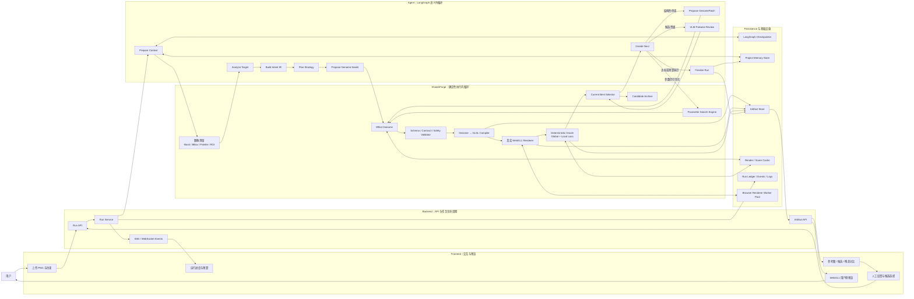
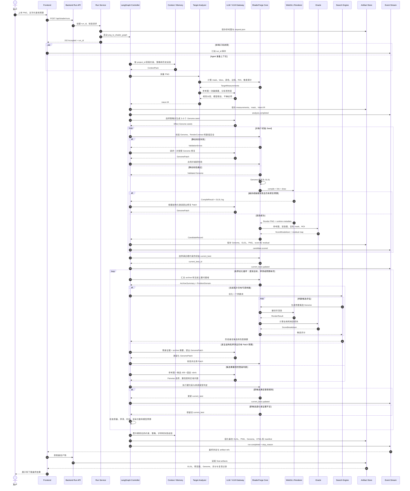
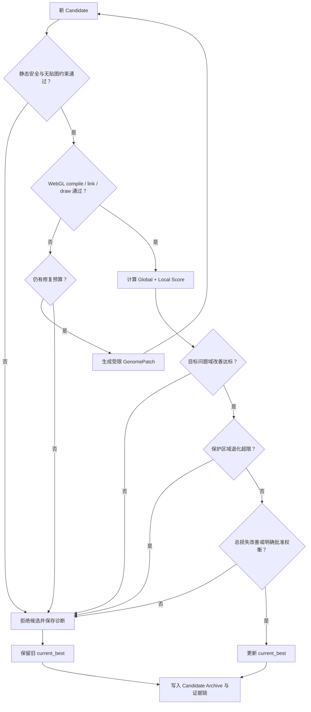
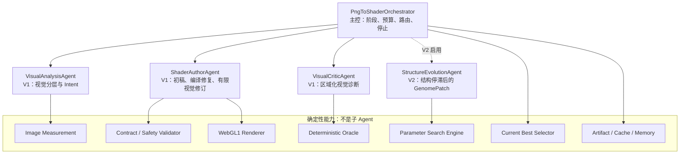

# PNG 转无贴图 Shader Agent：架构图与运行时序图

本文是《PNG 转无贴图 Shader Agent 最终架构》的配套图示，使用 Mermaid 编写，可直接在支持 Mermaid 的 Markdown 编辑器中渲染。

V1 的具体实现任务与各 Agent Prompt 见 `PNG转无贴图Shader-Agent-V1实现计划与Prompt.md`。

---

## 1. 完整系统架构图



### 图中最重要的边界

- Frontend 负责上传、展示、用户确认和兼容性预览，不承担唯一的自动迭代闭环。
- Backend 负责 HTTP、任务状态、事件和产物访问，不直接实现 Agent 节点或 Shader 算法。
- Agent 负责低频语义决策和结构修订，不进入每一次参数评估。
- ShaderForge 负责可重复的图像分析、编译、渲染、评分和搜索。
- WebGL1 Renderer 是运行时真值；Oracle 是自动接受候选的事实依据。
- `current_best` 只由确定性 Selector 更新，最后生成的候选不一定是最终结果。

---

## 2. 单次任务运行时序图



---

## 3. 运行时的候选接受子流程

这张小图强调 `current_best` 为什么不会被最后一次失败修改覆盖。



---

## 4. 运行时阶段概览

```text
提交任务
  → 上下文准备
  → PNG 确定性测量
  → VLM 视觉分层
  → Intent IR
  → 策略与 Genome seeds
  → 校验 / 编译 / WebGL 渲染
  → Oracle 评分
  → 选出 current_best
  → 参数优化或结构 Patch
  → VLM / HITL 晋级评审
  → 达标、停滞或预算耗尽
  → 固化最佳 GLSL 与复现证据
```

运行时的关键闭环是：

```text
Genome
  → Validate
  → Compile
  → Render
  → Score
  → Select Best
  → Optimize Parameters / Propose Patch
  → Genome
```

整个循环必须有最大时间、最大渲染次数、最大模型调用数、最大修复次数和最大结构 Patch 次数，任何分支都不能形成无界循环。

---

## 5. 主 Agent 与子 Agent 关系图

最终架构为 1 个主控 Agent 加 4 个专业子 Agent；V1 只启用前三个专业子 Agent。



### V1 子 Agent 清单

1. `VisualAnalysisAgent`：理解参考图，但不直接生成 GLSL。
2. `ShaderAuthorAgent`：生成初稿，并处理编译修复与有限视觉修订。
3. `VisualCriticAgent`：比较参考图与渲染图，输出区域化诊断。

V1 的三个子 Agent 都由 `PngToShaderOrchestrator` 调度。它们可以实现为 LangGraph 类型化节点或子图，不需要拆成三个独立服务。
