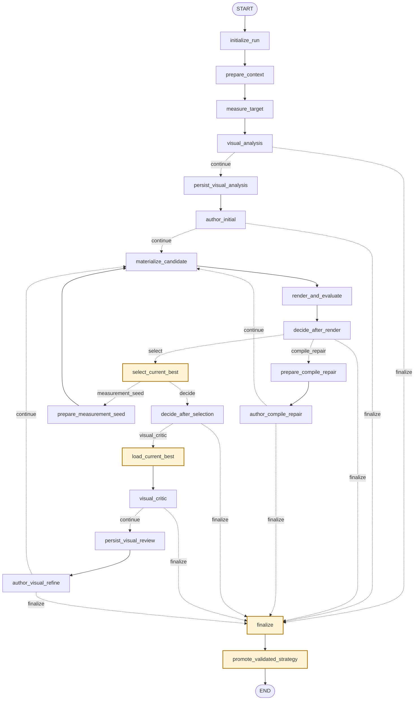
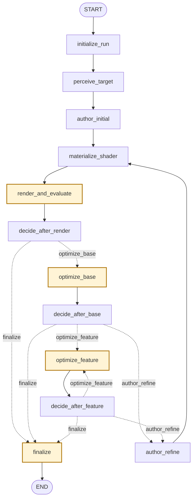

# Graphs 架构

`src/agent/app/graphs/` 保存 LangGraph 图入口。Graph 负责节点注册、边连接、条件跳转和 `compile()`。

## 当前图

- `png_to_shader_v1_graph.py`：现有产品 Graph，入口对象为 `png_to_shader_v1_graph`；执行 PNG-to-Shader V1 有界闭环。
- `png_to_shader_v1_routing.py`：M3 可独立单测的纯预算、停止和下一步路由规则。
- `png_to_shader_min_graph.py`：`scene_mvp` 最小技术链路，入口对象为 `png_to_shader_min_graph`；保留 12 节点骨架，Builder 注入 Gateway，当前使用严格 Model Author、确定性 fallback 和有界轻量微调。
- `png_to_shader_min_routing.py`：最小图的 3 个纯路由函数。

## Graph 规则

- Graph 只负责编排流程，不直接组装模型消息。
- Graph 是 LLM 组合根，通过 Builder 把具体 `LangChainLLMGateway` 注入 Node 工厂。
- 测试通过 V1 Builder 注入 Fake Gateway、Renderer factory、Evaluator、Artifact Store 和 clock，不 monkeypatch 具体客户端工厂。
- Node 不决定全局流程。
- 条件边变复杂、需要复用或需要独立测试时，再抽到 graph 附近的边逻辑模块。
- 每个对外运行的新图都必须注册到仓库根目录的 `langgraph.json`。
- 每个 `*_graph.py` 必须在 Builder 上方维护一份紧贴实现的 ASCII 图；本文件同时维护可渲染的 Mermaid 图。
- Mermaid 中的节点、直接边和字面量条件边必须与 `add_node`、`add_edge`、`add_conditional_edges` 一致；`make docs-check` 会静态检查遗漏和漂移。
- 新增或修改图后运行 `uv run langgraph validate`。

## 可视化维护工作流

Graph 的运行时代码是行为真相源；源码 ASCII 图是邻近实现的快速索引，本文件 Mermaid 是可渲染总览，条件路由表负责表达分支语义和安全边界。三者必须在同一次 Graph 改动中保持一致，不允许把可视化更新留作后续任务。

遇到下列任一变化时立即执行本节，而不是等到收尾时补文档：

- 新增、删除或重命名 Node；
- 修改 `add_edge`、`add_conditional_edges`、START/END、finalize 或循环回边；
- routing 函数新增/删除返回值，或已有返回值的触发条件、下一节点、失败含义发生变化；
- 修改 `current_best`、`unscored_fallback`、Artifact 重载、Renderer 关闭或 Memory 晋升边界；
- 新增、删除或重命名 `langgraph.json` 中的对外图。

维护顺序：

1. 先修改 Graph/routing 实现和对应测试。
2. 立即更新对应 `*_graph.py` Builder 上方的 ASCII 图，至少画出主路径、条件标签、循环和所有终止汇合点。
3. 更新本文件同名 `<!-- graph-diagram:<stem>:start/end -->` 区块；新增图时同时更新“当前图”清单和 `langgraph.json`。
4. 条件触发语义或安全边界变化时更新路由表及图后说明；仅移动连线但不更新解释同样视为未完成。
5. 运行 `make docs-check`、`uv run langgraph validate` 和受影响 Graph/routing 的定向测试；会话结束前在 `PROGRESS.md` 记录结果与未覆盖缺口。

自动检查边界：`make docs-check` 使用 AST 覆盖字面量 `add_node`、`add_edge` 和带字面量 path map 的 `add_conditional_edges`，并要求每个 `*_graph.py` 同时存在 ASCII 图和同名 Mermaid 区块。它不能理解动态 path map、routing 函数内部条件、隐式终止或表格文字是否准确；这些部分必须靠代码审查与定向测试维护。

## `png_to_shader_v1_graph` 有界闭环

<!-- graph-diagram:png_to_shader_v1_graph:start -->

<!-- graph-diagram:png_to_shader_v1_graph:end -->

### 条件路由表

| 路由节点 | 路由函数 | 结果 | 下一节点 | 含义 |
|---|---|---|---|---|
| `visual_analysis` | `model_node_outcome` | `continue` | `persist_visual_analysis` | 分析成功，保存绑定证据 |
| `visual_analysis` | `model_node_outcome` | `finalize` | `finalize` | 模型、结构化输出或预算失败 |
| `author_initial` | `model_node_outcome` | `continue` | `materialize_candidate` | 生成首个候选 |
| `author_initial` | `model_node_outcome` | `finalize` | `finalize` | 无法生成候选 |
| `decide_after_render` | `route_next_action` | `select` | `select_current_best` | 候选成功完成事实层；或已有 `current_best` 时，失败的 deterministic measurement seed 仍交给 Selector 写入拒绝证据，且不触发模型 compile repair |
| `decide_after_render` | `route_next_action` | `compile_repair` | `prepare_compile_repair` | 编译失败且仍有修复预算 |
| `decide_after_render` | `route_next_action` | `finalize` | `finalize` | 预算耗尽或满足终止条件 |
| `author_compile_repair` | `model_node_outcome` | `continue` | `materialize_candidate` | 修复结果作为新候选重新验证 |
| `author_compile_repair` | `model_node_outcome` | `finalize` | `finalize` | 修复模型失败或预算耗尽 |
| `select_current_best` | `route_after_candidate_selection` | `measurement_seed` | `prepare_measurement_seed` | 首个有效 model best 后生成一次独立的确定性 affine 根候选，不消耗模型/视觉预算 |
| `select_current_best` | `route_after_candidate_selection` | `decide` | `decide_after_selection` | seed 已尝试，或取消/时间停止，进入正常停止与 Critic 判断 |
| `decide_after_selection` | `route_next_action` | `visual_critic` | `load_current_best` | 从 Artifact 重载已验证 best |
| `decide_after_selection` | `route_next_action` | `finalize` | `finalize` | 质量达标、停滞或视觉预算耗尽 |
| `visual_critic` | `model_node_outcome` | `continue` | `persist_visual_review` | Critic 证据有效，保存 Review |
| `visual_critic` | `model_node_outcome` | `finalize` | `finalize` | Critic 失败时保留已有 best |
| `author_visual_refine` | `model_node_outcome` | `continue` | `materialize_candidate` | Refine 结果作为新候选重新验证 |
| `author_visual_refine` | `model_node_outcome` | `finalize` | `finalize` | Refine 失败时保留已有 best |

- `prepare_measurement_seed` 只依赖规范化参考图和 `TargetMeasurements`，生成 case-id/manifest/golden 无感知的静态 WebGL1 affine 候选；它是独立 root，最多一次，并进入与模型候选相同的 Validator、Renderer、Oracle、Selector 事实流水线。某一事实阶段失败时跳过不再适用的后续阶段；只要已有 `current_best`，失败 seed 仍进入 Selector 记录拒绝证据，但这不表示它通过了事实层，且拒绝不计入 stagnation。
- 所有环路都必须经过 compile/visual/model/wall-time 计数器；measurement seed 是不消耗模型和视觉迭代计数的一次性候选，且自定义预算不超过 V1 high 档；默认 recursion limit 96 是第二道保护。
- `stop_recommendation` 不能控制 Graph；Critic 只提供证据，下一步由 `png_to_shader_v1_routing.py` 决定。
- 黄色节点构成 `current_best` 安全边界：Critic、finalize 和 Memory 晋升只能读取选择器确认并重新加载的 best Artifact，不能把“最后一次候选”当成最终结果。
- 唯一例外是 Evaluator 超时或失败后的 `unscored_fallback`：候选必须已经通过静态 Validator、真实 WebGL compile/draw 并具有校验过 hash 的 render Artifact；它可作为 `completed_with_best_effort` 返回，但没有 score/metrics，不进入 Selector、Critic 或长期策略 Memory，API/UI 也不得称为 `current_best`。
- 已知模型供应商/结构化输出错误可以沿图安全 finalize 并保留已有 best；未知编程错误或不变量破坏必须越过 Graph，由 Backend 返回类型化 500，禁止伪装为 422 质量失败。
- V1 Builder 是 run 级组合根：Renderer registry 按 project/run 隔离复用，正常路径由 `finalize` 关闭；Builder 与 Agent Service 共享同一 registry，Service 在 `invoke()` 的 `finally` 中再次幂等关闭，覆盖未知编程错误或不变量破坏越过 Graph 的路径。外层兜底不是 Graph Node，不改变节点、边、路由或终止语义。M4 已通过独立 Agent Service 把该图接入 Backend persistence 生命周期，Graph 本身仍不依赖 FastAPI 或数据库连接池。

## `png_to_shader_min_graph` 快速贯通骨架

<!-- graph-diagram:png_to_shader_min_graph:start -->

<!-- graph-diagram:png_to_shader_min_graph:end -->

### 最小图条件路由表

| 决定节点 | 路由函数 | 结果 | 下一节点 | 含义 |
|---|---|---|---|---|
| `decide_after_render` | `route_after_render` | `optimize_base` | `optimize_base` | 首帧真实渲染成功、复合 loss 未达标且仍有 draw 预算 |
| 同上 | 同上 | `finalize` | `finalize` | 已达标、失败或预算耗尽 |
| `decide_after_base` | `route_after_base` | `optimize_feature` | `optimize_feature` | 获胜 scene 的真实 feature id queue 仍非空 |
| 同上 | 同上 | `author_refine` | `author_refine` | 特征耗尽但仍有模型与 Refine 预算 |
| 同上 | 同上 | `finalize` | `finalize` | 达标或预算结束 |
| `decide_after_feature` | `route_after_feature` | `optimize_feature` | `optimize_feature` | 按稳定 id 消费获胜 scene 的下一个 feature |
| 同上 | 同上 | `author_refine` | `author_refine` | feature queue 已空且仍可 Refine |
| 同上 | 同上 | `finalize` | `finalize` | 达标或预算结束 |

- 黄色节点构成最小图的 `current_best` 安全边界。Initial 的模型 scene 与确定性感知 fallback 在预算允许时都由 `render_and_evaluate` 真实渲染，先按 `min_scene_composite_v2` 选择较优起点；基础与特征优化都只在复合 loss 严格改善时提交。该指标组合整图、前景、高光和阴影 MAE，全局 MAE 继续作为诊断，避免大面积背景稀释主体误差。
- `author_initial` 通过注入的 `LLMGateway` 请求完整 MinScene，调用或严格解析失败则使用确定性感知 fallback；`author_refine` 只接受一个 path/operation/value 白名单 patch，并且永远从 `current_best.scene` 派生候选。语义调用与最多一次结构修复共用 run 级 6 次硬上限；质量档位分别把 render/LLM/Refine 硬预算设为 `fast=48/2/1`、`balanced=96/4/2`、`high=160/6/3`。
- `optimize_base` 与 `optimize_feature` 使用固定顺序、白名单、边界裁剪的小批确定性候选；模块单批硬上限为 32，Graph 对 base/每个真实 feature 分别请求最多 32/16 个，并按所选档位剩余 draw 预算截断。每个 proposal 会重放到最新 best，使同批接受的参数变化累计生效；不实现随机搜索或 CMA-ES。
- Refine patch 只产生待评估工作 scene，不能直接写 `current_best`；随后 `render_and_evaluate` 仅在真实复合 loss 严格改善时提交，否则回滚工作 scene，非法输出、调用异常和较差候选均保留原 best。
- 同一 run 的固定模板通过 `prepared_uniforms_v1` 只编译/链接一次，候选只热更新 typed uniform；最终导出 GLSL 仍烘焙常量，可由旧 `render()` 独立执行。prepared 对象只存在 run registry，`finalize` 与 Service `finally` 共用幂等关闭；CMA-ES 仍未实现。
