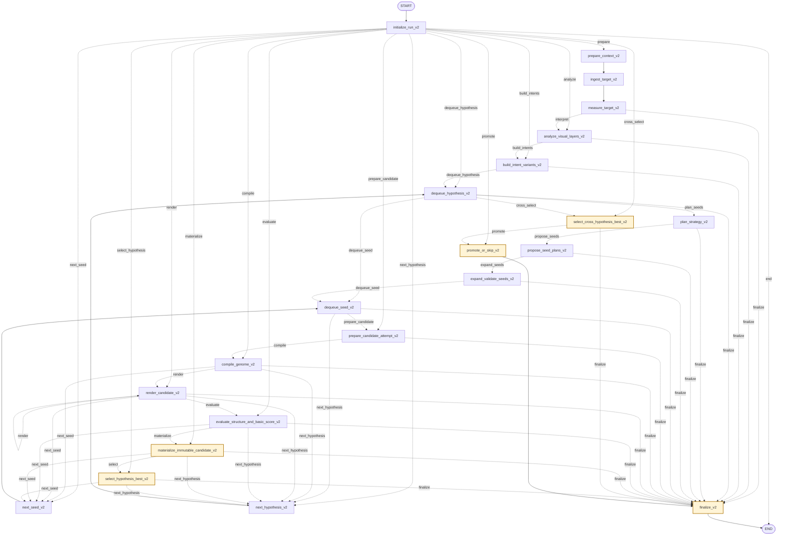

# Graphs 架构

`src/agent/app/graphs/` 保存 LangGraph 图入口。Graph 负责节点注册、边连接、条件跳转和 `compile()`。

## 当前图

- `png_to_shader_v1_graph.py`：唯一对外 Graph，入口对象为 `png_to_shader_v1_graph`；执行 PNG-to-Shader V1 有界闭环。
- `png_to_shader_v1_routing.py`：M3 可独立单测的纯预算、停止和下一步路由规则。
- `png_to_shader_v2_builder.py`：V2.4 development-only Builder；22 个 production nodes 覆盖正式有界流程，但尚未注册到 `langgraph.json`，不得作为 product-active Graph。
- `png_to_shader_v2_routing.py`：V2.4 可独立单测的 hypothesis/seed/render-progress/failure/budget 路由规则。

## Graph 规则

- Graph 只负责编排流程，不直接组装模型消息。
- Graph 是 LLM 组合根，通过 Builder 把具体 `LangChainLLMGateway` 注入 Node 工厂。
- 测试通过 V1 Builder 注入 Fake Gateway、Renderer factory、Evaluator、Artifact Store 和 clock，不 monkeypatch 具体客户端工厂。
- Node 不决定全局流程。
- 条件边变复杂、需要复用或需要独立测试时，再抽到 graph 附近的边逻辑模块。
- 每个对外运行的新图都必须注册到仓库根目录的 `langgraph.json`。
- 每个 `*_graph.py` 必须在 Builder 上方维护一份紧贴实现的 ASCII 图；本文件同时维护可渲染的 Mermaid 图。
- Mermaid 中的节点、直接边和字面量条件边必须与 `add_node`、`add_edge`、`add_conditional_edges` 一致；`make docs-check` 会静态检查遗漏和漂移。
- 新增或修改图后运行 `uv run langgraph validate`。

## 可视化维护工作流

Graph 的运行时代码是行为真相源；源码 ASCII 图是邻近实现的快速索引，本文件 Mermaid 是可渲染总览，条件路由表负责表达分支语义和安全边界。三者必须在同一次 Graph 改动中保持一致，不允许把可视化更新留作后续任务。

遇到下列任一变化时立即执行本节，而不是等到收尾时补文档：

- 新增、删除或重命名 Node；
- 修改 `add_edge`、`add_conditional_edges`、START/END、finalize 或循环回边；
- routing 函数新增/删除返回值，或已有返回值的触发条件、下一节点、失败含义发生变化；
- 修改 `current_best`、`unscored_fallback`、Artifact 重载、Renderer 关闭或 Memory 晋升边界；
- 新增、删除或重命名 `langgraph.json` 中的对外图。

维护顺序：

1. 先修改 Graph/routing 实现和对应测试。
2. 立即更新对应 `*_graph.py` Builder 上方的 ASCII 图，至少画出主路径、条件标签、循环和所有终止汇合点。
3. 更新本文件同名 `<!-- graph-diagram:<stem>:start/end -->` 区块；product-active `*_graph.py` 新增图时同时更新“当前图”清单和 `langgraph.json`，development-only `*_builder.py` 只维护可视化，不得借此注册。
4. 条件触发语义或安全边界变化时更新路由表及图后说明；仅移动连线但不更新解释同样视为未完成。
5. 运行 `make docs-check`、`uv run langgraph validate` 和受影响 Graph/routing 的定向测试；会话结束前在 `PROGRESS.md` 记录结果与未覆盖缺口。

自动检查边界：`make docs-check` 使用 AST 覆盖字面量 `add_node`、`add_edge` 和带字面量 path map 的 `add_conditional_edges`，并要求每个 `*_graph.py` 与 development-only `*_builder.py` 同时存在 ASCII 图和同名 Mermaid 区块。它不能理解动态 path map、routing 函数内部条件、隐式终止或表格文字是否准确；这些部分必须靠代码审查与定向测试维护。

## `png_to_shader_v2_builder` development-only 有界流程

<!-- graph-diagram:png_to_shader_v2_builder:start -->

<!-- graph-diagram:png_to_shader_v2_builder:end -->

### V2.4 条件路由表

| 路由节点 | 路由函数 | 结果 | 下一节点 | 含义 |
|---|---|---|---|---|
| `initialize_run_v2` | `route_after_initialize` | `prepare` / `analyze` / `build_intents` / `dequeue_hypothesis` / `prepare_candidate` / `compile` / `render` / `evaluate` / `materialize` / `select_hypothesis` / `cross_select` / `promote` / `next_seed` / `next_hypothesis` / `end` | phase/ref 对应最后确认边界 | fresh 才进入 prepare；恢复不降级 phase，已确认成功阶段不重跑，失败 attempt 继续有界 loop，finalized 幂等到 END |
| `measure_target_v2` | `route_after_measurement` | `interpret` / `finalize` | `analyze_visual_layers_v2` / `finalize_v2` | Graph 前 source→measurement 生产完成后，Node 只重放验证 typed Measurement Artifact；恢复失败即终止 |
| `analyze_visual_layers_v2` | `route_after_interpretation` | `build_intents` / `finalize` | `build_intent_variants_v2` / `finalize_v2` | 既有 ref 不调用模型；缺 ref 时仅调用显式 provider，并在副作用前持久化模型调用 reservation |
| `build_intent_variants_v2` | `route_after_intent_build` | `dequeue_hypothesis` / `finalize` | `dequeue_hypothesis_v2` / `finalize_v2` | 至少一个 hard-constraint 可行 Intent 才进入 loop |
| `dequeue_hypothesis_v2` | `route_after_hypothesis` | `plan_seeds` / `dequeue_seed` / `cross_select` / `finalize` | 对应计划、seed、跨分支选择或终止节点 | pending/running/completed/failed 游标显式推进 |
| `plan_strategy_v2` | `route_after_strategy` | `propose_seeds` / `finalize` | `propose_seed_plans_v2` / `finalize_v2` | Strategy Artifact 恢复或物化失败时不继续 |
| `propose_seed_plans_v2` | `route_after_seed_proposal` | `expand_seeds` / `finalize` | `expand_validate_seeds_v2` / `finalize_v2` | 只接受确定性三计划集合 |
| `expand_validate_seeds_v2` | `route_after_seed_planning` | `dequeue_seed` / `finalize` | `dequeue_seed_v2` / `finalize_v2` | 三 genome semantic/structural diversity gate 必须通过 |
| `dequeue_seed_v2` | `route_after_seed` | `prepare_candidate` / `next_hypothesis` / `finalize` | `prepare_candidate_attempt_v2` / `next_hypothesis_v2` / `finalize_v2` | seed 与 candidate-attempt 预算显式有界；minimum-complexity 是冻结 fallback |
| `prepare_candidate_attempt_v2` | `route_after_candidate_preparation` | `compile` / `finalize` | `compile_genome_v2` / `finalize_v2` | attempt reservation 已持久化并结算才编译 |
| `compile_genome_v2` | `route_after_compile` | `render` / `next_seed` / `next_hypothesis` / `finalize` | 对应节点 | CompilerDefect fail-run；普通非法 Seed/Genome 才继续 loop |
| `render_candidate_v2` | `route_after_render` | `render` / `evaluate` / `next_seed` / `next_hypothesis` / `finalize` | self-loop、评分或对应推进节点 | immutable plan 固定五次实际 beauty 后接全部 diagnostic；每次 node invocation 最多执行一个 physical call，未完成 plan 返回 `render` self-loop。每个 logical request 最多两次 physical call，unknown/transient 才可占用第二次；progress、request、environment、PNG、attempt evidence 与预算 revision 全部进入闭包 |
| `evaluate_structure_and_basic_score_v2` | `route_after_evaluation` | `materialize` / `next_seed` / `next_hypothesis` / `finalize` | 对应节点 | Oracle 不可用不得伪造 score；已有 best 时安全终止 |
| `materialize_immutable_candidate_v2` | `route_after_materialization` | `select` / `next_seed` / `next_hypothesis` / `finalize` | 对应节点 | 只有 typed Compiler replay 与 hard constraint closure 完整通过才物化 Candidate |
| `select_hypothesis_best_v2` | `route_after_candidate_selection` | `next_seed` / `next_hypothesis` / `finalize` | 对应节点 | 只在同 hypothesis 内按 loss、candidate id 稳定排序 |
| `select_cross_hypothesis_best_v2` | `route_after_cross_selection` | `promote` / `finalize` | `promote_or_skip_v2` / `finalize_v2` | 只有 objective best 才进入可选 admission/promotion |

- `langgraph.json` 仍只注册当前 product-active 的 V1。V2 Builder 供 V2.4 development/validation Harness 使用；production admission 与 Graph 切换均未获准。
- `PngToShaderV2NodeRuntime` 默认没有 Interpretation provider、Renderer、Evaluator 或 promotion sink，因此不会隐式调用真实模型、浏览器或网络。当前 candidate-attempt、render-call、model-call（仅 fixture/mock provider）与全部 Artifact bytes 都先通过 State Store `reserve_budget` 持久化 reservation，再执行，最后 `commit_budget`。Renderer 还必须先以 `active_render_call_ordinal` 持久化稳定调用 intent；调用结果 evidence 在预算 commit 前落 checkpoint。若进程在调用边界崩溃，孤立 reservation 会生成 `unknown` evidence 并消费对应 ordinal，逻辑 request 总调用数仍不超过 2，绝不重新获得完整两次机会。
- V2.4 fixture gate 把 `wall_time_ms`、`model_tokens` 和 `cost_usd_micros` 的 limit 设为 0，表示该 AI-off profile 不启用这三个维度，不得据此宣称七维 production 预算闭合。真实模型/product enable 仍 blocked，后续 Service 必须注入 monotonic deadline 与 typed model call receipt，才能结算 wall-time、tokens 和 cost。
- V2 State 只携带 `ArtifactRefV2`、稳定 attempt id/hash 和小型游标。`initialize_run_v2` 先按最后确认 phase 路由，active refs 不能让 materialized/selected 边界回退；每次 Node 恢复 Artifact 都重验完整 ref、size/SHA-256、typed Schema 与 Intent/Genome identity。Candidate 只有经过 typed closure loader 才进入 Selector。
- `production_admission_enabled` 默认 `false`。即便显式打开，Node 也必须先调用 sealed `decide_trusted_runtime_admission()`，且仅 `admitted` 才可创建 promotion outbox。外部 sink 必须实现按稳定 `operation_id` 的幂等 `execute/recover`：调用前持久 `promotion_operation_ref`，只有 sink 可证明 `completed` 并返回外部 receipt identity 后才持久 `promotion_receipt_ref`；恢复为 `not_executed` 才允许首次/继续 execute，`unknown` 一律 fail closed 且不重放。因此这里只承诺 at-most-once execute 与可恢复完成，不伪称跨系统 exactly-once。unknown、unsupported、identity mismatch 或恢复失败均保证 sink=0。`effect_genome_expander_v2` 仅在冻结的 solid、单实例、零孔及九项已证明 layer capability 内可到 sink；background、复杂 topology、多实例和有孔结构仍被拒绝。该开发 Builder 不注册 `langgraph.json`，Backend/V1/product 开关也没有改变。

## `png_to_shader_v1_graph` 有界闭环

<!-- graph-diagram:png_to_shader_v1_graph:start -->

<!-- graph-diagram:png_to_shader_v1_graph:end -->

### 条件路由表

| 路由节点 | 路由函数 | 结果 | 下一节点 | 含义 |
|---|---|---|---|---|
| `visual_analysis` | `model_node_outcome` | `continue` | `persist_visual_analysis` | 分析成功，保存绑定证据 |
| `visual_analysis` | `model_node_outcome` | `finalize` | `finalize` | 模型、结构化输出或预算失败 |
| `author_initial` | `model_node_outcome` | `continue` | `materialize_candidate` | 生成首个候选 |
| `author_initial` | `model_node_outcome` | `finalize` | `finalize` | 无法生成候选 |
| `decide_after_render` | `route_next_action` | `select` | `select_current_best` | 候选成功完成事实层；或已有 `current_best` 时，失败的 deterministic measurement seed 仍交给 Selector 写入拒绝证据，且不触发模型 compile repair |
| `decide_after_render` | `route_next_action` | `compile_repair` | `prepare_compile_repair` | 编译失败且仍有修复预算 |
| `decide_after_render` | `route_next_action` | `finalize` | `finalize` | 预算耗尽或满足终止条件 |
| `author_compile_repair` | `model_node_outcome` | `continue` | `materialize_candidate` | 修复结果作为新候选重新验证 |
| `author_compile_repair` | `model_node_outcome` | `finalize` | `finalize` | 修复模型失败或预算耗尽 |
| `select_current_best` | `route_after_candidate_selection` | `measurement_seed` | `prepare_measurement_seed` | 首个有效 model best 后生成一次独立的确定性 affine 根候选，不消耗模型/视觉预算 |
| `select_current_best` | `route_after_candidate_selection` | `decide` | `decide_after_selection` | seed 已尝试，或取消/时间停止，进入正常停止与 Critic 判断 |
| `decide_after_selection` | `route_next_action` | `visual_critic` | `load_current_best` | 从 Artifact 重载已验证 best |
| `decide_after_selection` | `route_next_action` | `finalize` | `finalize` | 质量达标、停滞或视觉预算耗尽 |
| `visual_critic` | `model_node_outcome` | `continue` | `persist_visual_review` | Critic 证据有效，保存 Review |
| `visual_critic` | `model_node_outcome` | `finalize` | `finalize` | Critic 失败时保留已有 best |
| `author_visual_refine` | `model_node_outcome` | `continue` | `materialize_candidate` | Refine 结果作为新候选重新验证 |
| `author_visual_refine` | `model_node_outcome` | `finalize` | `finalize` | Refine 失败时保留已有 best |

- `prepare_measurement_seed` 只依赖规范化参考图和 `TargetMeasurements`，生成 case-id/manifest/golden 无感知的静态 WebGL1 affine 候选；它是独立 root，最多一次，并进入与模型候选相同的 Validator、Renderer、Oracle、Selector 事实流水线。某一事实阶段失败时跳过不再适用的后续阶段；只要已有 `current_best`，失败 seed 仍进入 Selector 记录拒绝证据，但这不表示它通过了事实层，且拒绝不计入 stagnation。
- 所有环路都必须经过 compile/visual/model/wall-time 计数器；measurement seed 是不消耗模型和视觉迭代计数的一次性候选，且自定义预算不超过 V1 Ultra 档。Ultra 的 10 次视觉优化、5 次编译修复最坏合法路径约 133 个 Graph step，默认 recursion limit 256 是第二道保护。
- 产品请求的 budget/acceptance 由 Backend 从启动时冻结的版本化 YAML 解析后显式注入 State；Graph 仍保留 Ultra 硬上限复核。`run-config.json` 与 final manifest 同时记录配置 Schema、内容 SHA-256 和生效策略；直接调用 Graph 未提供配置身份时允许为 `null`，但仍使用显式 State 策略或代码默认值。
- `stop_recommendation` 不能控制 Graph；Critic 只提供证据，下一步由 `png_to_shader_v1_routing.py` 决定。
- 黄色节点构成 `current_best` 安全边界：Critic、finalize 和 Memory 晋升只能读取选择器确认并重新加载的 best Artifact，不能把“最后一次候选”当成最终结果。
- ShaderForge Selector 已提供 keyword-only 的版本化 measurement seed admission 集成点，但本 V1 Graph 仍只按原三参数调用：`TargetMeasurements` 不含可验证的 topology/instance/hole/required-layer 事实，生产不得读取 benchmark Manifest 或把模型描述当作硬证据。独立 runtime geometry verifier 已存在并只能产出不可准入的 `geometry_verified`；required-layer 完整性、持久化恢复和本 Graph 的端到端接入尚未完成，因此 `runtime_verified` 仍固定为 unknown。当前 Graph 节点、边、路由和 `current_best` 生产安全语义均不变。
- 唯一例外是 Evaluator 超时或失败后的 `unscored_fallback`：候选必须已经通过静态 Validator、真实 WebGL compile/draw 并具有校验过 hash 的 render Artifact；它可作为 `completed_with_best_effort` 返回，但没有 score/metrics，不进入 Selector、Critic 或长期策略 Memory，API/UI 也不得称为 `current_best`。
- 已知模型供应商/结构化输出错误可以沿图安全 finalize 并保留已有 best；未知编程错误或不变量破坏必须越过 Graph，由 Backend 返回类型化 500，禁止伪装为 422 质量失败。
- V1 Builder 是 run 级组合根：Renderer registry 按 project/run 隔离复用，正常路径由 `finalize` 关闭；Builder 与 Agent Service 共享同一 registry，Service 在 `invoke()` 的 `finally` 中再次幂等关闭，覆盖未知编程错误或不变量破坏越过 Graph 的路径。外层兜底不是 Graph Node，不改变节点、边、路由或终止语义。M4 已通过独立 Agent Service 把该图接入 Backend persistence 生命周期，Graph 本身仍不依赖 FastAPI 或数据库连接池。
